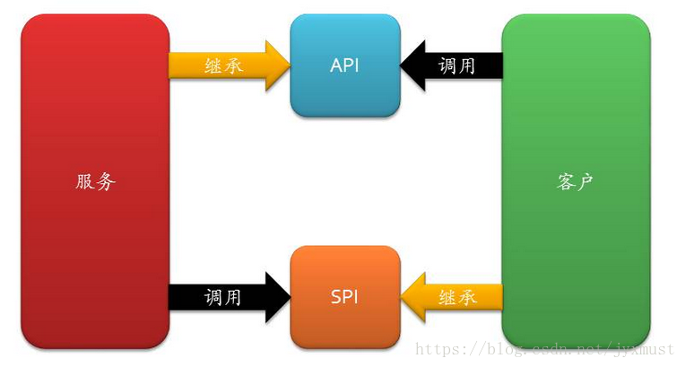
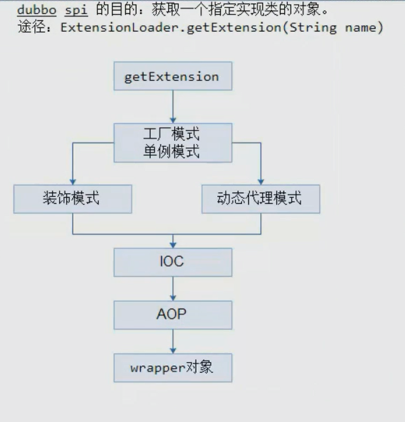
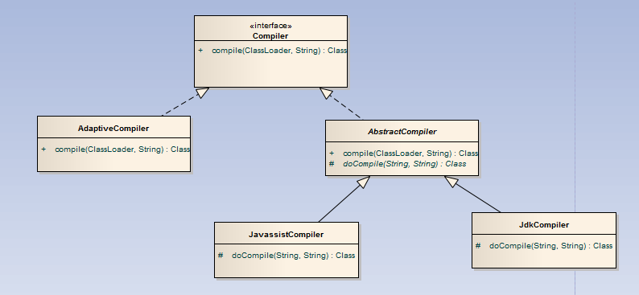
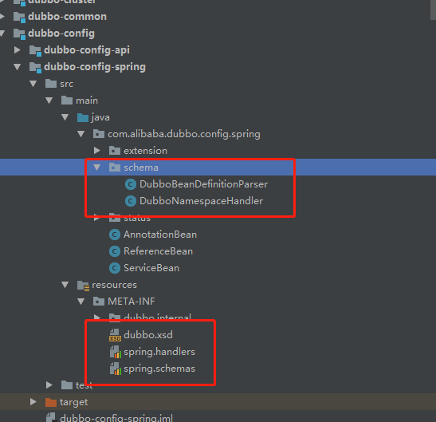
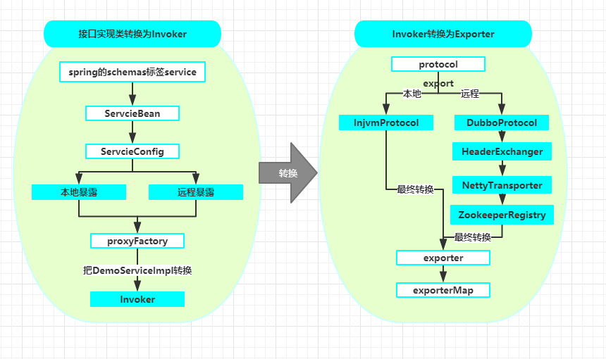
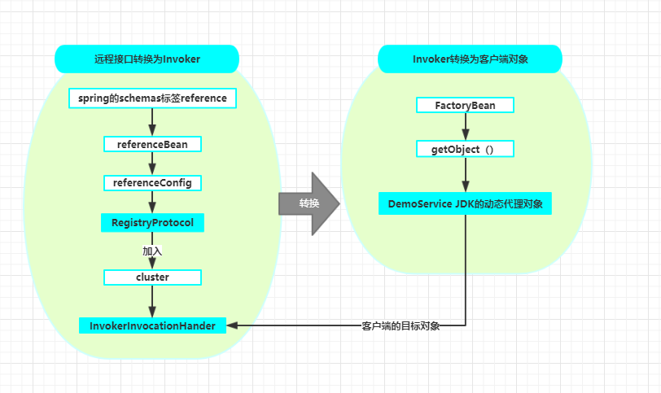
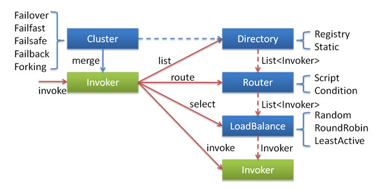
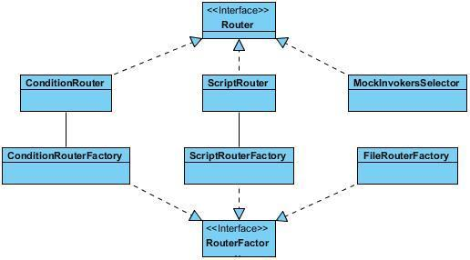
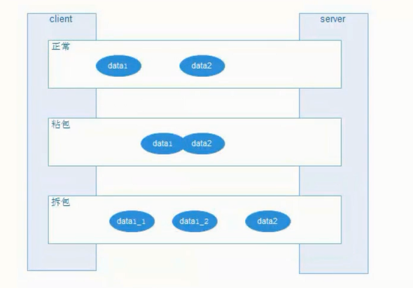

## 1、Dubbo的架构原理

### Dubbo架构图


### 节点角色说明

|节点|	角色说明|
| ------- | ---- |
|Provider|	暴露服务的服务提供方|
|Consumer	|调用远程服务的服务消费方|
|Registry |	服务注册与发现的注册中心|
| Monitor	|  统计服务的调用次数和调用时间的监控中心|
|Container	| 服务运行容器 |

### 调用关系说明

1.  provider启动时，会把所有接口注册到注册中心，并且订阅动态配置configurators
2.  consumer启动时，向注册中心订阅自己所需的providers，configurators，routers
3.  订阅内容变更时，registry将基于长连接推送变更数据给consumer，包括providers，configurators，routers
4.  consumer启动时，从provider地址列表中，基于软负载均衡算法，选一台provider进行调用，如果调用失败，再选另一台调用，建立长连接，然后进行数据通信（consumer->provider）
5.  consumer、provider启动后，在内存中累计调用次数和调用时间，定时每分钟发送一次统计数据到monitor

### 整体架构分层设计

Dubbo框架设计一共划分了10个层，而最上面的Service层是留给实际想要使用Dubbo开发分布式服务的开发者实现业务逻辑的接口层。图中左边淡蓝背景的为服务消费方使用的接口，右边淡绿色背景的为服务提供方使用的接口， 位于中轴线上的为双方都用到的接口。
- 接口服务层(Service):该层与业务逻辑相关，根据 provider 和 consumer 的业 务设计对应的接口和实现
- 配置层(Config):对外配置接口，以 ServiceConfig 和 ReferenceConfig 为中心 
- 服务代理层(Proxy):服务接口透明代理，生成服务的客户端 Stub 和 服务端的Skeleton，以 ServiceProxy 为中心，扩展接口为 ProxyFactory
- 服务注册层(Registry):封装服务地址的注册和发现，以服务 URL 为中心，扩展接 口为 RegistryFactory、Registry、RegistryService
- 路由层(Cluster):封装多个提供者的路由和负载均衡，并桥接注册中心，以 Invoker 为中心，扩展接口为 Cluster、Directory、Router 和 LoadBlancce
- 监控层(Monitor):RPC 调用次数和调用时间监控，以 Statistics 为中心，扩展接 口为 MonitorFactory、Monitor 和 MonitorService
- 远程调用层(Protocal):封装 RPC 调用，以 Invocation 和 Result 为中心，扩展 接口为 Protocal、Invoker 和 Exporter
- 信息交换层(Exchange):封装请求响应模式，同步转异步。以 Request 和 Response 为中心，扩展接口为 Exchanger、ExchangeChannel、ExchangeClient 和 ExchangeServer
- 网络传输层(Transport):抽象 mina 和 netty 为统一接口，以 Message 为中心，扩展接口为 Channel、Transporter、Client、Server 和 Codec
- 数据序列化层(Serialize):可复用的一些工具，扩展接口为 Serialization、 ObjectInput、ObjectOutput 和 ThreadPool

根据官方提供的，对于上述各层之间关系的描述，如下所示：
1. 在RPC中，Protocol是核心层，也就是只要有Protocol + Invoker + Exporter就可以完成非透明的RPC调用，然后在Invoker的主过程上Filter拦截点。
2. 图中的Consumer和Provider是抽象概念，只是想让看图者更直观的了解哪些分类属于客户端与服务器端，不用Client和Server的原因是Dubbo在很多场景下都使用Provider、Consumer、Registry
、Monitor划分逻辑拓普节点，保持概念统一。
3. 而Cluster是外围概念，所以Cluster的目的是将多个Invoker伪装成一个Invoker，这样其它人只要关注Protocol层Invoker即可，加上Cluster或者去掉Cluster
对其它层都不会造成影响，因为只有一个提供者时，是不需要Cluster的。
4. Proxy层封装了所有接口的透明化代理，而在其它层都以Invoker为中心，只有到了暴露给用户使用时，才用Proxy将Invoker转成接口，或将接口实现转成Invoker，也就是去掉Proxy层RPC是可以Run
的，只是不那么透明，不那么看起来像调本地服务一样调远程服务。
5. 而Remoting实现是Dubbo协议的实现，如果你选择RMI协议，整个Remoting都不会用上，Remoting内部再划为Transport传输层和Exchange信息交换层，Transport层只负责单向消息传输，是对Mina
、Netty、Grizzly的抽象，它也可以扩展UDP传输，而Exchange层是在传输层之上封装了Request-Response语义。
6. Registry和Monitor实际上不算一层，而是一个独立的节点，只是为了全局概览，用层的方式画在一起。


### Dubbo和Spring Cloud区别
1. 最大的区别就是通信方式不同，Dubbo底层是使用Netty这样的NIO框架，是基于TCP协议传输，配合hession序列化进行RPC调用
2. SpringCloud是基于Http协议+Rest接口调用远程过程的通信，相比之下，Http拥有更大的报文，rest比rpc更加灵活，不存在代码级别的强依赖


## 2、Dubbo自己的SPI实现

Dubbo内核包括四个：SPI（模仿JDK的SPI）、AOP（模仿Spring）、IOC（模仿Spring）、compiler（动态编译）


### SPI的设计目标

1. 面向对象的设计里，模块之间基于接口编程，模块之间不对实现类进行硬编码（硬编码：数据直接嵌入到程序）
2. 一旦代码涉及具体的实现类，就违反了可拔插的原则，如果需要替换一种实现，就需要修改代码
3. 为了实现在模块中装配的时候，不在模块里写死代码，这就需要一种服务发现机制
4. 为某个接口寻找服务实现的机制，有点类似IOC的思想，就是将装配的控制权转移到代码之外


### SPI的具体约定

1. 当服务的提供者（provide），提供了一个接口多种实现时，一般会在jar包的META_INF/services/目录下，创建该接口的同名文件，该文件里面的内容就是该服务接口的具体实现类的名称
2. 当外部加载这个模块的时候，就能通过jar包的META_INF/services/目录的配置文件得到具体的实现类名，并加载实例化，完成模块的装配


### dubbo为什么不直接使用JDK的SPI？

1. JDK标准的SPI会一次性实例化扩展点所有实现，如果有扩展实现初始化很耗时，但如果没用上也加载，会很浪费资源
2. dubbo的SPI增加了对扩展点IoC和AOP的支持，一个扩展点可以直接setter注入其他扩展点，JDK的SPI是没有的


### dubbo的SPI目的：获取一个实现类的对象
途径：ExtensionLoader.getExtension(String name)
实现路径：

1.  getExtensionLoader（Class< Type > type）就是为该接口new 一个ExtensionLoader，然后缓存起来。
2.  getAdaptiveExtension（） 获取一个扩展类，如果@Adaptive注解在类上就是一个装饰类；如果注解在方法上就是一个动态代理类，例如Protocol$Adaptive对象。
3.  getExtension（String name） 获取一个指定对象。


### ExtensionLoader
ExtensionLoader扩展点加载器，是扩展点的查找，校验，加载等核心逻辑的实现类，几乎所有特性都在这个类中实现

从ExtensionLoader.getExtensionLoader（Class< Type > type）讲起

```
-----------------------ExtensionLoader.getExtensionLoader(Class<T> type)
ExtensionLoader.getExtensionLoader(Container.class)
  -->this.type = type;
  -->objectFactory = (type == ExtensionFactory.class ? null : ExtensionLoader.getExtensionLoader(ExtensionFactory.class).getAdaptiveExtension());
     -->ExtensionLoader.getExtensionLoader(ExtensionFactory.class).getAdaptiveExtension()
       -->this.type = type;
       -->objectFactory =null;
```
执行以上代码完成了2个属性的初始化，是每个一个ExtensionLoader都包含了的2个值type和objectFactory

- Class< ? > type: 构造器 初始化要得到的接口名

- ExtensionFactory objectFactory ：

  1、构造器 初始化AdaptiveExtensionFactory[ SpiExtensionFactory, SpringExtensionFactory] 

  2、new一个ExtensionLoader存储在ConcurrentMap< Class< ? >, ExtensionLoader< ? > > EXTENSION_LOADERS

### 关于objectFactory的一些细节

1. objectFactory 就是ExtensionFactory ，也是通过ExtensionLoader.getExtensionLoader(ExtensionFactory.class)来实现，但objectFactory  = null;
2. objectFactory 的作用就是为dubbo的IOC提供所有对象


## 3、SPI 与 API的区别

API  （Application Programming Interface）

- 大多数情况下，都是实现方来制定接口并完成对接口的不同实现，调用方仅仅依赖却无权选择不同实现。


SPI (Service Provider Interface)

- 而如果是调用方来制定接口，实现方来针对接口来实现不同的实现。调用方来选择自己需要的实现方。


当我们选择在调用方和实现方中间引入接口。我们有三种选择：

1. 接口位于实现方所在的包中
2. 接口位于调用方所在的包中
3. 接口位于独立的包中


### 1. 接口位于【调用方】所在的包中
对于类似这种情况下接口，我们将其称为 SPI, SPI的规则如下：

- 概念上更依赖调用方。
- 组织上位于调用方所在的包中。
- 实现位于独立的包中。


常见的例子是：插件模式的插件。如：

- 数据库驱动 Driver
- 日志 Log
- dubbo扩展点开发

### 2. 接口位于【实现方】所在的包中
对于类似这种情况下的接口，我们将其称作为API，API的规则如下：

- 概念上更接近实现方。
- 组织上位于实现方所在的包中。

### 3. 接口位于独立的包中
如果一个“接口”在一个上下文是API，在另一个上下文是SPI，那么你就可以这么组织




## 4、SPI机制的adaptive原理
先来看一下adaptive的源码
```java
@Documented
@Retention(RetentionPolicy.RUNTIME)
@Target({ElementType.TYPE, ElementType.METHOD})  //只能注解在类、接口、方法上面
public @interface Adaptive {

    String[] value() default {};

}
```

### @adaptive注解在类和方法上的区别

1. 注解在类上：代表人工实现编码，即实现了一个装饰类（设计模式中的装饰模式），例如：ExtensionFactory
2. 注解在方法上：代表自动生成和编译一个动态的adpative类，例如：Protocol$adpative

再来看生成Protocol的源码
```java
private static final Protocol protocol = ExtensionLoader.getExtensionLoader(Protocol.class)
            .getAdaptiveExtension();
```
进入getAdaptiveExtension()，进行代码跟踪与解析
```java
-----------------------getAdaptiveExtension()
 -->getAdaptiveExtension()   //目的为  cachedAdaptiveInstance赋值
   -->createAdaptiveExtension()
     -->getAdaptiveExtension()
       -->getExtensionClasses()   //目的为cachedClasses赋值
         -->loadExtensionClasses()  //加载
           -->loadFile()  //加载配置信息（主要是META_INF/services/下）
      -->createAdaptiveExtensionClass()  //下面的调用有两个分支
         // *********** 分支1 *******************  在找到的类上有Adaptive注解
        ->getExtensionClasses()
        　　　　　　->loadExtensionClasses()
        　　　　　　　　->loadFile(extensionClasses, DUBBO_INTERNAL_DIRECTORY);
          // *********** 分支2 ******************* 在找到的类上没有Adaptive注解
        -->createAdaptiveExtensionClassCode()//通过adaptive模板生成代码
          -->ExtensionLoader.getExtensionLoader(com.alibaba.dubbo.common.compiler.Compiler.class).getAdaptiveExtension();//编译
          -->compile(String code, ClassLoader classLoader) //自动生成和编译一个动态的adpative类，这个类是个代理类
       -->injectExtension()//作用：进入IOC的反转控制模式，实现了动态入注,这是 ExtensionFactory 类的作用之所在 
```
上述的调用中使用loadFile()加载配置信息，下面关于loadFile() 的一些细节：

### loadFile()的目的
把配置文件META-INF/dubbo/internal/com.alibaba.dubbo.rpc.Protocol的内容存储在缓存变量里面,下面四种缓存变量：

1. cachedAdaptiveClass //如果这个类有Adaptive注解就赋值，而Protocol在这个环节是没有的
2. cachedWrapperClasses //只有当该class无Adaptive注解，并且构造函数包含目标接口（type），例如protocol里面的spi就只有ProtocolFilterWrapper、ProtocolListenerWrapper能命中
3. cachedActivates //剩下的类包含adaptive注解
4. cachedNames //剩下的类就存储在这里


getExtension() 方法执行逻辑：
```java
-----------------------getExtension(String name)
getExtension(String name) //指定对象缓存在cachedInstances；get出来的对象wrapper对象，例如protocol就是ProtocolFilterWrapper和ProtocolListenerWrapper其中一个。
  -->createExtension(String name)
    -->getExtensionClasses()
    -->injectExtension(T instance)//dubbo的IOC反转控制，就是从spi和spring里面提取对象赋值。
      -->objectFactory.getExtension(pt, property)
        -->SpiExtensionFactory.getExtension(type, name)
          -->ExtensionLoader.getExtensionLoader(type)
          -->loader.getAdaptiveExtension()
        -->SpringExtensionFactory.getExtension(type, name)
          -->context.getBean(name)
    -->injectExtension((T) wrapperClass.getConstructor(type).newInstance(instance))//AOP的简单设计
    
```

可以根据方法的调用得出dubbo的spi流程



adaptive动态编译使用的模板
```java
package <扩展点接口所在包>;
 
public class <扩展点接口名>$Adpative implements <扩展点接口> {
    public <有@Adaptive注解的接口方法>(<方法参数>) {
        if(是否有URL类型方法参数?) 使用该URL参数
        else if(是否有方法类型上有URL属性) 使用该URL属性
        # <else 在加载扩展点生成自适应扩展点类时抛异常，即加载扩展点失败！>
         
        if(获取的URL == null) {
            throw new IllegalArgumentException("url == null");
        }
 
              根据@Adaptive注解上声明的Key的顺序，从URL获致Value，作为实际扩展点名。
               如URL没有Value，则使用缺省扩展点实现。如没有扩展点， throw new IllegalStateException("Fail to get extension");
 
               在扩展点实现调用该方法，并返回结果。
    }
 
    public <有@Adaptive注解的接口方法>(<方法参数>) {
        throw new UnsupportedOperationException("is not adaptive method!");
    }
}
```
例如com.alibaba.dubbo.rpc.Protocol接口的动态编译根据模板生成的扩展类Protocol$Adpative为：
```java
package com.alibaba.dubbo.rpc;

import com.alibaba.dubbo.common.extension.ExtensionLoader;

public class Protocol$Adpative implements Protocol {

    public void destroy() {
        throw new UnsupportedOperationException("method public abstract void com.alibaba.dubbo.rpc.Protocol.destroy() of interface com.alibaba.dubbo.rpc.Protocol is not adaptive method!");
    }

    public int getDefaultPort() {
        throw new UnsupportedOperationException("method public abstract int com.alibaba.dubbo.rpc.Protocol.getDefaultPort() of interface com.alibaba.dubbo.rpc.Protocol is not adaptive method!");
    }

    public com.alibaba.dubbo.rpc.Exporter export(Invoker invoker) throws RpcException {
        if (invoker == null) throw new IllegalArgumentException("com.alibaba.dubbo.rpc.Invoker argument == null");
        if (invoker.getUrl() == null)
            throw new IllegalArgumentException("com.alibaba.dubbo.rpc.Invoker argument getUrl() == null");
        com.alibaba.dubbo.common.URL url = invoker.getUrl();
        String extName = (url.getProtocol() == null ? "dubbo" : url.getProtocol());
        if (extName == null)
            throw new IllegalStateException("Fail to get extension(com.alibaba.dubbo.rpc.Protocol) name from url(" + url.toString() + ") use keys([protocol])");
        Protocol extension = ExtensionLoader.getExtensionLoader(Protocol.class).getExtension(extName);
        return extension.export(invoker);
    }

    public com.alibaba.dubbo.rpc.Invoker refer(java.lang.Class arg0, com.alibaba.dubbo.common.URL arg1) throws RpcException {
        if (arg1 == null) throw new IllegalArgumentException("url == null");
        com.alibaba.dubbo.common.URL url = arg1;
        String extName = (url.getProtocol() == null ? "dubbo" : url.getProtocol());
        if (extName == null)
            throw new IllegalStateException("Fail to get extension(com.alibaba.dubbo.rpc.Protocol) name from url(" + url.toString() + ") use keys([protocol])");
        com.alibaba.dubbo.rpc.Protocol extension = (com.alibaba.dubbo.rpc.Protocol) ExtensionLoader.getExtensionLoader(com.alibaba.dubbo.rpc.Protocol.class).getExtension(extName);
        return extension.refer(arg0, arg1);
    }
}
```

### 总结

1、获取某个SPI接口的adaptive实现类的规则是：

- 实现类的类上面有Adaptive注解的，那么这个类就是adaptive类
- 实现类的类上面没有Adaptive注解，但是在方法上有Adaptive注解，则会动态生成adaptive类

2、生成的动态类的编译类是：com.alibaba.dubbo.common.compiler.support.AdaptiveCompiler类

3、动态类的本质是可以做到一个SPI中的不同的Adaptive方法可以去调不同的SPI实现类去处理。使得程序的灵活性大大提高,这才是整套SPI设计的一个精华之所在。


## 5、Dubbo的动态编译


Compile接口定义：
```java
@SPI("javassist")
public interface Compiler {

    Class<?> compile(String code, ClassLoader classLoader);

}
```
- @SPI(“javassist”)：表示如果没有配置，dubbo默认选用javassist编译源代码，Javassist是一款字节码编辑工具,同时也是一个动态类库，它可以直接检查、修改以及创建 Java类。
- 接口方法compile第一个入参code，就是java的源代码
- 接口方法compile第二个入参classLoader，按理是类加载器用来加载编译后的字节码，其实没用到，都是根据当前线程或者调用方的classLoader加载的


AdaptiveCompiler是Compiler的设配类，它的作用是Compiler策略的选择，根据条件选择使用何种编译策略来编译动态生成SPI扩展 ，默认为javassist.

AbstractCompiler是一个抽象类，它通过正则表达式获取到对象的包名以及Class名称。这样就可以获取对象的全类名(包名+Class名称)。通过反射Class.forName()来判断当前ClassLoader是否有这个类，如果有就返回，如果没有就通过JdkCompiler或者JavassistCompiler通过传入的code编译这个类。

```java
      com.alibaba.dubbo.common.compiler.Compiler compiler = ExtensionLoader.getExtensionLoader(com.alibaba.dubbo.common.compiler.Compiler.class).getAdaptiveExtension();
```
- getExtensionLoader()：new一个ExtensionLoader对象，用到单例模式、工厂模式，然后换成起来。
- getAdaptiveExtension()：为了获取扩展装饰类或代理类的对像，不过有个规则：如果@Adaptive注解在类上就是一个装饰类；如果注解在方法上就是一个动态代理类。

```java
public abstract class AbstractCompiler implements Compiler {

    private static final Pattern PACKAGE_PATTERN = Pattern.compile("package\\s+([$_a-zA-Z][$_a-zA-Z0-9\\.]*);");

    private static final Pattern CLASS_PATTERN = Pattern.compile("class\\s+([$_a-zA-Z][$_a-zA-Z0-9]*)\\s+");

    public Class<?> compile(String code, ClassLoader classLoader) {
        code = code.trim();
        Matcher matcher = PACKAGE_PATTERN.matcher(code);//包名  
        String pkg;
        if (matcher.find()) {
            pkg = matcher.group(1);
        } else {
            pkg = "";
        }
        matcher = CLASS_PATTERN.matcher(code);//类名  
        String cls;
        if (matcher.find()) {
            cls = matcher.group(1);
        } else {
            throw new IllegalArgumentException("No such class name in " + code);
        }
        String className = pkg != null && pkg.length() > 0 ? pkg + "." + cls : cls;
        try {
            return Class.forName(className, true, ClassHelper.getCallerClassLoader(getClass()));//根据类全路径来查找类  
        } catch (ClassNotFoundException e) {
            if (!code.endsWith("}")) {
                throw new IllegalStateException("The java code not endsWith \"}\", code: \n" + code + "\n");
            }
            try {
                return doCompile(className, code);//调用实现类JavassistCompiler或JdkCompiler的doCompile方法来动态编译类  
            } catch (RuntimeException t) {
                throw t;
            } catch (Throwable t) {
                throw new IllegalStateException("Failed to compile class, cause: " + t.getMessage() + ", class: " + className + ", code: \n" + code + "\n, stack: " + ClassUtils.toString(t));
            }
        }
    }

    protected abstract Class<?> doCompile(String name, String source) throws Throwable;

}

```
AbstractCompiler：在公用逻辑中，利用正则表达式匹配出源代码中的包名和类名： 

- PACKAGE_PATTERN = Pattern.compile("package\\s+([$_a-zA-Z][$_a-zA-Z0-9\\.]*);"); 

- CLASS_PATTERN = Pattern.compile("class\\s+([$_a-zA-Z][$_a-zA-Z0-9]*)\\s+"); 


然后在JVM中查找看看是否存在：Class.forName(className, true, ClassHelper.getCallerClassLoader(getClass()));存在返回，不存在就使用JavassistCompiler或者是JdkCompiler来执行编译。 


## 6、dubbo和spring完美融合
dubbo采取通过配置文件来启动container容器，dubbo是使用spring来做容器


dubbo实现通过下面的配置schema自定义配置


**完成一个spring的自定义配置一般需要以下5个步骤：**

1. 设计配置属性和JavaBean
2. 编写XSD文件 全称就是 XML Schema  它就是校验XML，定义了一些列的语法来规范XML
3. 编写NamespaceHandler和BeanDefinitionParser完成解析工作
4. 编写两个类spring.handlers和spring.schemas串联起所有部件
5. 在Bean文件中应用


### 1. 设计配置属性和JavaBean
先配置属性dubbo.xml，可以看出一个service对象，有属性包括，interface、ref等


```xml
<!-- 和本地bean一样实现服务 -->
<dubbo:service interface="com.alibaba.dubbo.demo.DemoService" ref="demoService"/>
```

### 2. 编写XSD文件 全称就是 XML Schema  它就是校验XML，定义了一些列的语法来规范XML
下面是dubbo.xsd文件,作用是约束interface和ref属性，比如ref只能是string类，输入其他类型就提示报错
```xml
 <xsd:element name="service" type="serviceType">
        <xsd:annotation>
            <xsd:documentation><![CDATA[ Export service config ]]></xsd:documentation>
        </xsd:annotation>
    </xsd:element>

  <xsd:complexType name="serviceType">
        <xsd:complexContent>
            <xsd:extension base="abstractServiceType">
                <xsd:choice minOccurs="0" maxOccurs="unbounded">
                    <xsd:element ref="method" minOccurs="0" maxOccurs="unbounded"/>
                    <xsd:element ref="parameter" minOccurs="0" maxOccurs="unbounded"/>
                    <xsd:element ref="beans:property" minOccurs="0" maxOccurs="unbounded"/>
                </xsd:choice>
                <xsd:attribute name="interface" type="xsd:token" use="required">
                    <xsd:annotation>
                        <xsd:documentation>
                            <![CDATA[ Defines the interface to advertise for this service in the service registry. ]]></xsd:documentation>
                        <xsd:appinfo>
                            <tool:annotation>
                                <tool:expected-type type="java.lang.Class"/>
                            </tool:annotation>
                        </xsd:appinfo>
                    </xsd:annotation>
                </xsd:attribute>
                <xsd:attribute name="ref" type="xsd:string" use="optional">
                    <xsd:annotation>
                        <xsd:documentation>
                            <![CDATA[ The service implementation instance bean id. ]]></xsd:documentation>
                    </xsd:annotation>
                </xsd:attribute>
            </xsd:extension>
        </xsd:complexContent>
    </xsd:complexType>
```
### 3. 编写NamespaceHandler和BeanDefinitionParser完成解析工作
DubboNamespaceHandler这个类是个处理器，初始化时将各种bean注册到解析器上，将配置文件的值赋值到bean上
```java
public class DubboNamespaceHandler extends NamespaceHandlerSupport {

    static {
        Version.checkDuplicate(DubboNamespaceHandler.class);
    }

    public void init() {
        registerBeanDefinitionParser("application", new DubboBeanDefinitionParser(ApplicationConfig.class, true));
        registerBeanDefinitionParser("module", new DubboBeanDefinitionParser(ModuleConfig.class, true));
        registerBeanDefinitionParser("registry", new DubboBeanDefinitionParser(RegistryConfig.class, true));
        registerBeanDefinitionParser("monitor", new DubboBeanDefinitionParser(MonitorConfig.class, true));
        registerBeanDefinitionParser("provider", new DubboBeanDefinitionParser(ProviderConfig.class, true));
        registerBeanDefinitionParser("consumer", new DubboBeanDefinitionParser(ConsumerConfig.class, true));
        registerBeanDefinitionParser("protocol", new DubboBeanDefinitionParser(ProtocolConfig.class, true));
        registerBeanDefinitionParser("service", new DubboBeanDefinitionParser(ServiceBean.class, true));
        registerBeanDefinitionParser("reference", new DubboBeanDefinitionParser(ReferenceBean.class, false));
        registerBeanDefinitionParser("annotation", new DubboBeanDefinitionParser(AnnotationBean.class, true));
    }

}
```
解析器DubboBeanDefinitionParser，代码太长就不贴了，解析器大概作用：从配置文件中通过element.getAttribute(String name)拿到属性的值，赋给bean。
​                                      
​                              
那么问题来了，dubbo.xsd和DubboNamespaceHandler 、DubboBeanDefinitionParser 这两个类是关联起来呢？第四步来解决这个问题


### 4. 编写两个类spring.handlers和spring.schemas串联起所有部件
最后也是通过两个类spring.handlers和spring.schemas串联起所有部件
spring.handlers
```xml
http\://code.alibabatech.com/schema/dubbo=com.alibaba.dubbo.config.spring.schema.DubboNamespaceHandler
```
spring.schemas

```xml
http\://code.alibabatech.com/schema/dubbo/dubbo.xsd=META-INF/dubbo.xsd
```
### 5. 在Bean文件中应用


## 7、服务发布过程
启动服务提供者的时候通过打印出来的日志知道整个服务发现流程：

第一个发布的动作：暴露本地服务

```xml
	Export dubbo service com.alibaba.dubbo.demo.DemoService to local registry, dubbo version: 2.0.0, current host: 127.0.0.1
```


第二个发布动作：暴露远程服务

```xml
	Export dubbo service com.alibaba.dubbo.demo.DemoService to url dubbo://192.168.100.38:20880/com.alibaba.dubbo.demo.DemoService?anyhost=true&application=demo-provider&dubbo=2.0.0&generic=false&interface=com.alibaba.dubbo.demo.DemoService&loadbalance=roundrobin&methods=sayHello&owner=william&pid=8484&side=provider&timestamp=1473908495465, dubbo version: 2.0.0, current host: 127.0.0.1
	Register dubbo service com.alibaba.dubbo.demo.DemoService url dubbo://192.168.100.38:20880/com.alibaba.dubbo.demo.DemoService?anyhost=true&application=demo-provider&dubbo=2.0.0&generic=false&interface=com.alibaba.dubbo.demo.DemoService&loadbalance=roundrobin&methods=sayHello&monitor=dubbo%3A%2F%2F192.168.48.117%3A2181%2Fcom.alibaba.dubbo.registry.RegistryService%3Fapplication%3Ddemo-provider%26backup%3D192.168.48.120%3A2181%2C192.168.48.123%3A2181%26dubbo%3D2.0.0%26owner%3Dwilliam%26pid%3D8484%26protocol%3Dregistry%26refer%3Ddubbo%253D2.0.0%2526interface%253Dcom.alibaba.dubbo.monitor.MonitorService%2526pid%253D8484%2526timestamp%253D1473908495729%26registry%3Dzookeeper%26timestamp%3D1473908495398&owner=william&pid=8484&side=provider&timestamp=1473908495465 to registry registry://192.168.48.117:2181/com.alibaba.dubbo.registry.RegistryService?application=demo-provider&backup=192.168.48.120:2181,192.168.48.123:2181&dubbo=2.0.0&owner=william&pid=8484&registry=zookeeper&timestamp=1473908495398, dubbo version: 2.0.0, current host: 127.0.0.1
```

第三个发布动作：启动netty

```xml
	Start NettyServer bind /0.0.0.0:20880, export /192.168.100.38:20880, dubbo version: 2.0.0, current host: 127.0.0.1
```

第四个发布动作：打开连接zk

```xml
	INFO zookeeper.ClientCnxn: Opening socket connection to server /192.168.48.117:2181
```

第五个发布动作：到zk注册

```xml
	Register: dubbo://192.168.100.38:20880/com.alibaba.dubbo.demo.DemoService?anyhost=true&application=demo-provider&dubbo=2.0.0&generic=false&interface=com.alibaba.dubbo.demo.DemoService&loadbalance=roundrobin&methods=sayHello&owner=william&pid=8484&side=provider&timestamp=1473908495465, dubbo version: 2.0.0, current host: 127.0.0.1
```

第六个发布动作；监听zk

```xml
	Subscribe: provider://192.168.100.38:20880/com.alibaba.dubbo.demo.DemoService?anyhost=true&application=demo-provider&category=configurators&check=false&dubbo=2.0.0&generic=false&interface=com.alibaba.dubbo.demo.DemoService&loadbalance=roundrobin&methods=sayHello&owner=william&pid=8484&side=provider&timestamp=1473908495465, dubbo version: 2.0.0, current host: 127.0.0.1
	Notify urls for subscribe url provider://192.168.100.38:20880/com.alibaba.dubbo.demo.DemoService?anyhost=true&application=demo-provider&category=configurators&check=false&dubbo=2.0.0&generic=false&interface=com.alibaba.dubbo.demo.DemoService&loadbalance=roundrobin&methods=sayHello&owner=william&pid=8484&side=provider&timestamp=1473908495465, urls: [empty://192.168.100.38:20880/com.alibaba.dubbo.demo.DemoService?anyhost=true&application=demo-provider&category=configurators&check=false&dubbo=2.0.0&generic=false&interface=com.alibaba.dubbo.demo.DemoService&loadbalance=roundrobin&methods=sayHello&owner=william&pid=8484&side=provider&timestamp=1473908495465], dubbo version: 2.0.0, current host: 127.0.0.1
```


### 暴露本地服务和暴露远程服务的区别是什么？

1. 暴露本地服务：指暴露在一个JVM里面，不用通过调用zk来进行远程通信。例如：在同一个服务，自己调用自己的接口，就没必要进行网络IP连接来通信。
2. 暴露远程服务：指暴露给远程客户端的IP和端口号，通过网络来实现通信。

```java
ServiceBean.onApplicationEvent
-->export()
  -->ServiceConfig.export()
    -->doExport()
      -->doExportUrls()//里面有一个for循环，代表了一个服务可以有多个通信协议，例如 tcp协议 http协议，默认是tcp协议
        -->loadRegistries(true)//从dubbo.properties里面组装registry的url信息
        -->doExportUrlsFor1Protocol(ProtocolConfig protocolConfig, List<URL> registryURLs) 
          //配置不是remote的情况下做本地暴露 (配置为remote，则表示只暴露远程服务)
          -->exportLocal(URL url)
            -->proxyFactory.getInvoker(ref, (Class) interfaceClass, local)
              -->ExtensionLoader.getExtensionLoader(com.alibaba.dubbo.rpc.ProxyFactory.class).getExtension("javassist");
              -->extension.getInvoker(arg0, arg1, arg2)
                -->StubProxyFactoryWrapper.getInvoker(T proxy, Class<T> type, URL url) 
                  -->proxyFactory.getInvoker(proxy, type, url)
                    -->JavassistProxyFactory.getInvoker(T proxy, Class<T> type, URL url)
                      -->Wrapper.getWrapper(com.alibaba.dubbo.demo.provider.DemoServiceImpl)
                        -->makeWrapper(Class<?> c)
                      -->return new AbstractProxyInvoker<T>(proxy, type, url)
            -->protocol.export
              -->Protocol$Adpative.export
                -->ExtensionLoader.getExtensionLoader(com.alibaba.dubbo.rpc.Protocol.class).getExtension("injvm");
                -->extension.export(arg0)
                  -->ProtocolFilterWrapper.export
                    -->buildInvokerChain //创建8个filter
                    -->ProtocolListenerWrapper.export
                      -->InjvmProtocol.export
                        -->return new InjvmExporter<T>(invoker, invoker.getUrl().getServiceKey(), exporterMap)
                        -->目的：exporterMap.put(key, this)//key=com.alibaba.dubbo.demo.DemoService, this=InjvmExporter
          //如果配置不是local则暴露为远程服务.(配置为local，则表示只暴露本地服务)
          -->proxyFactory.getInvoker//原理和本地暴露一样都是为了获取一个Invoker对象
          -->protocol.export(invoker)
            -->Protocol$Adpative.export
              -->ExtensionLoader.getExtensionLoader(com.alibaba.dubbo.rpc.Protocol.class).getExtension("registry");
	            -->extension.export(arg0)
	              -->ProtocolFilterWrapper.export
	                -->ProtocolListenerWrapper.export
	                  -->RegistryProtocol.export
	                    -->doLocalExport(originInvoker)
	                      -->getCacheKey(originInvoker);//读取 dubbo://192.168.100.51:20880/
	                      -->rotocol.export
	                        -->Protocol$Adpative.export
	                          -->ExtensionLoader.getExtensionLoader(com.alibaba.dubbo.rpc.Protocol.class).getExtension("dubbo");
	                          -->extension.export(arg0)
	                            -->ProtocolFilterWrapper.export
	                              -->buildInvokerChain//创建8个filter
	                              -->ProtocolListenerWrapper.export
---------1.netty服务暴露的开始-------    -->DubboProtocol.export
	                                  -->serviceKey(url)//组装key=com.alibaba.dubbo.demo.DemoService:20880
	                                  -->目的：exporterMap.put(key, this)//key=com.alibaba.dubbo.demo.DemoService:20880, this=DubboExporter
	                                  -->openServer(url)
	                                    -->createServer(url)
--------2.信息交换层 exchanger 开始-------------->Exchangers.bind(url, requestHandler)//exchaanger是一个信息交换层
	                                        -->getExchanger(url)
	                                          -->getExchanger(type)
	                                            -->ExtensionLoader.getExtensionLoader(Exchanger.class).getExtension("header")
	                                        -->HeaderExchanger.bind
	                                          -->Transporters.bind(url, new DecodeHandler(new HeaderExchangeHandler(handler)))
	                                            -->new HeaderExchangeHandler(handler)//this.handler = handler
	                                            -->new DecodeHandler
	                                            	-->new AbstractChannelHandlerDelegate//this.handler = handler;
---------3.网络传输层 transporter--------------------->Transporters.bind
	                                              -->getTransporter()
	                                                -->ExtensionLoader.getExtensionLoader(Transporter.class).getAdaptiveExtension()
	                                              -->Transporter$Adpative.bind
	                                                -->ExtensionLoader.getExtensionLoader(com.alibaba.dubbo.remoting.Transporter.class).getExtension("netty");
	                                                -->extension.bind(arg0, arg1)
	                                                  -->NettyTransporter.bind
	                                                    --new NettyServer(url, listener)
	                                                      -->AbstractPeer //this.url = url;    this.handler = handler;
	                                                      -->AbstractEndpoint//codec  timeout=1000  connectTimeout=3000
	                                                      -->AbstractServer //bindAddress accepts=0 idleTimeout=600000
---------4.打开断开，暴露netty服务-------------------------------->doOpen()
	                                                        -->设置 NioServerSocketChannelFactory boss worker的线程池 线程个数为3
	                                                        -->设置编解码 hander
	                                                        -->bootstrap.bind(getBindAddress())
	                                            -->new HeaderExchangeServer
	                                              -->this.server=NettyServer
	                                              -->heartbeat=60000
	                                              -->heartbeatTimeout=180000
	                                              -->startHeatbeatTimer()//这是一个心跳定时器，采用了线程池，如果断开就心跳重连。

	                    -->getRegistry(originInvoker)//zk 连接
	                      -->registryFactory.getRegistry(registryUrl)
	                        -->ExtensionLoader.getExtensionLoader(RegistryFactory.class).getExtension("zookeeper");
	                        -->extension.getRegistry(arg0)
	                          -->AbstractRegistryFactory.getRegistry//创建一个注册中心，存储在REGISTRIES
	                            -->createRegistry(url)
	                              -->new ZookeeperRegistry(url, zookeeperTransporter)
	                                -->AbstractRegistry
	                                  -->loadProperties()//目的：把C:\Users\bobo\.dubbo\dubbo-registry-192.168.48.117.cache
	                                                                                                                                                                    文件中的内容加载为properties
	                                  -->notify(url.getBackupUrls())//不做任何事             
	                                -->FailbackRegistry   
	                                  -->retryExecutor.scheduleWithFixedDelay(new Runnable()//建立线程池，检测并连接注册中心,如果失败了就重连
	                                -->ZookeeperRegistry
	                                  -->zookeeperTransporter.connect(url)
	                                    -->ZookeeperTransporter$Adpative.connect(url)
	                                      -->ExtensionLoader.getExtensionLoader(ZookeeperTransporter.class).getExtension("zkclient");
	                                      -->extension.connect(arg0)
	                                        -->ZkclientZookeeperTransporter.connect
	                                          -->new ZkclientZookeeperClient(url)
	                                            -->AbstractZookeeperClient
	                                            -->ZkclientZookeeperClient
	                                              -->new ZkClient(url.getBackupAddress());//连接ZK
	                                              -->client.subscribeStateChanges(new IZkStateListener()//订阅的目标：连接断开，重连
	                                    -->zkClient.addStateListener(new StateListener() 
	                                      -->recover //连接失败 重连
	                                      
	                    -->registry.register(registedProviderUrl)//创建节点
	                      -->AbstractRegistry.register
	                      -->FailbackRegistry.register
	                        -->doRegister(url)//向zk服务器端发送注册请求
	                          -->ZookeeperRegistry.doRegister
	                            -->zkClient.create
	                              -->AbstractZookeeperClient.create//dubbo/com.alibaba.dubbo.demo.DemoService/providers/
										                              dubbo%3A%2F%2F192.168.100.52%3A20880%2Fcom.alibaba.dubbo.demo.DemoService%3Fanyhost%3Dtrue%26
										                              application%3Ddemo-provider%26dubbo%3D2.0.0%26generic%3Dfalse%26interface%3D
										                              com.alibaba.dubbo.demo.DemoService%26loadbalance%3Droundrobin%26methods%3DsayHello%26owner%3
										                              Dwilliam%26pid%3D2416%26side%3Dprovider%26timestamp%3D1474276306353
	                                -->createEphemeral(path);//临时节点  dubbo%3A%2F%2F192.168.100.52%3A20880%2F.............
	                                -->createPersistent(path);//持久化节点 dubbo/com.alibaba.dubbo.demo.DemoService/providers
	                                    
	                                    
	                    -->registry.subscribe//订阅ZK
	                      -->AbstractRegistry.subscribe
	                      -->FailbackRegistry.subscribe
	                        -->doSubscribe(url, listener)// 向服务器端发送订阅请求
	                          -->ZookeeperRegistry.doSubscribe
	                            -->new ChildListener()
	                              -->实现了 childChanged
	                                -->实现并执行 ZookeeperRegistry.this.notify(url, listener, toUrlsWithEmpty(url, parentPath, currentChilds));
	                              //A
	                            -->zkClient.create(path, false);//第一步：先创建持久化节点/dubbo/com.alibaba.dubbo.demo.DemoService/configurators
	                            -->zkClient.addChildListener(path, zkListener)
	                              -->AbstractZookeeperClient.addChildListener
	                                //C
	                                -->createTargetChildListener(path, listener)//第三步：收到订阅后的处理，交给FailbackRegistry.notify处理
	                                  -->ZkclientZookeeperClient.createTargetChildListener
	                                    -->new IZkChildListener() 
	                                      -->实现了 handleChildChange //收到订阅后的处理
	                                      	-->listener.childChanged(parentPath, currentChilds);
	                                      	-->实现并执行ZookeeperRegistry.this.notify(url, listener, toUrlsWithEmpty(url, parentPath, currentChilds));
	                                      	-->收到订阅后处理 FailbackRegistry.notify
	                                //B      	
	                                -->addTargetChildListener(path, targetListener)////第二步
	                                  -->ZkclientZookeeperClient.addTargetChildListener
	                                    -->client.subscribeChildChanges(path, listener)//第二步：启动加入订阅/dubbo/com.alibaba.dubbo.demo.DemoService/configurators
	                    
	                    -->notify(url, listener, urls)
	                      -->FailbackRegistry.notify
	                        -->doNotify(url, listener, urls);
	                          -->AbstractRegistry.notify
	                            -->saveProperties(url);//把服务端的注册url信息更新到C:\Users\bobo\.dubbo\dubbo-registry-192.168.48.117.cache
	                              -->registryCacheExecutor.execute(new SaveProperties(version));//采用线程池来处理
	                            -->listener.notify(categoryList)
	                              -->RegistryProtocol.notify
	                                -->RegistryProtocol.this.getProviderUrl(originInvoker)//通过invoker的url 获取 providerUrl的地址
```

### 服务发布整体架构设计图


### 重要概念

1、proxyFactory：为了获取一个接口的代理类，例如获取一个远程接口的代理
它有2个方法，代表2个作用：

1. getInvoker（）：针对server端，将服务对象，如DemoServiceImpl包装成一个Invoker对象
2. getProxy（）：针对client端，创建接口的代理对象，例如DemoService的接口

2、Wrapper：它类似spring的beanWrapper，它就是包装了一个接口或一个类，可以通过wrapper对实例对象进行赋值以及制定方法的调用

3、Invoker：一个可执行的对象，能够根据方法的名称、参数得到相应的执行结果。
 它里面有一个很重要的方法Result invoke（Invocation invocation），Invocation是包含了需要执行的方法和参数等重要信息，目前只有两个实现类。RpcInvocation 、MockInvocation 
它有三种类型的Invoker：

 1. 本地执行的Invoker  
 2. 远程通信的Invoker  
 3. 多个远程通信执行类的Invoker聚合成集群版的Invoker

4、Protocol

1. export:暴露远程服务（用于服务端），就是将proxyFactory.getInvoker创建的代理类invoker对象，通过协议暴露给外部
2. refer：引用远程服务（用于客户端），通过proxyFactory.getProxy来创建远程的动态代理类，例如DemoDemoService的接口

5、exporter：维护invoker的生命周期

6、exchanger：信息交换层，封装请求相应模式，同步转异步

7、transporter：网络传输层，用来抽象netty和mina的统一接口
​    
​    
​    
​    
​    
​    

## 8、服务调用过程
下面是服务引用详细的代码跟踪与解析
```java
ReferenceBean.getObject()
  -->ReferenceConfig.get()
    -->init()
      -->createProxy(map)
        -->refprotocol.refer(interfaceClass, urls.get(0))
          -->ExtensionLoader.getExtensionLoader(Protocol.class).getExtension("registry");
          -->extension.refer(arg0, arg1);
            -->ProtocolFilterWrapper.refer
              -->RegistryProtocol.refer
                -->registryFactory.getRegistry(url)//建立zk的连接，和服务端发布一样（省略代码）
                -->doRefer(cluster, registry, type, url)
                  -->registry.register//创建zk的节点，和服务端发布一样（省略代码）。节点名为：dubbo/com.alibaba.dubbo.demo.DemoService/consumers
                  -->registry.subscribe//订阅zk的节点，和服务端发布一样（省略代码）。   /dubbo/com.alibaba.dubbo.demo.DemoService/providers, 
                                                                        /dubbo/com.alibaba.dubbo.demo.DemoService/configurators,
                                                                         /dubbo/com.alibaba.dubbo.demo.DemoService/routers]
                    -->notify(url, listener, urls);
                      -->FailbackRegistry.notify
                        -->doNotify(url, listener, urls);
                          -->AbstractRegistry.notify
                            -->saveProperties(url);//把服务端的注册url信息更新到C:\Users\bobo\.dubbo\dubbo-registry-192.168.48.117.cache
	                          -->registryCacheExecutor.execute(new SaveProperties(version));//采用线程池来处理
	                        -->listener.notify(categoryList)
	                          -->RegistryDirectory.notify
	                            -->refreshInvoker(invokerUrls)//刷新缓存中的invoker列表
	                              -->destroyUnusedInvokers(oldUrlInvokerMap,newUrlInvokerMap); // 关闭未使用的Invoker
	                              -->最终目的：刷新Map<String, Invoker<T>> urlInvokerMap 对象
	                                                                                                                       刷新Map<String, List<Invoker<T>>> methodInvokerMap对象
                  -->cluster.join(directory)//加入集群路由
                    -->ExtensionLoader.getExtensionLoader(com.alibaba.dubbo.rpc.cluster.Cluster.class).getExtension("failover");
                      -->MockClusterWrapper.join
                        -->this.cluster.join(directory)
                          -->FailoverCluster.join
                            -->return new FailoverClusterInvoker<T>(directory)
                            -->new MockClusterInvoker
        -->proxyFactory.getProxy(invoker)//创建服务代理
          -->ProxyFactory$Adpative.getProxy
            -->ExtensionLoader.getExtensionLoader(com.alibaba.dubbo.rpc.ProxyFactory.class).getExtension("javassist");
              -->StubProxyFactoryWrapper.getProxy
                -->proxyFactory.getProxy(invoker)
                  -->AbstractProxyFactory.getProxy
                    -->getProxy(invoker, interfaces)
                      -->Proxy.getProxy(interfaces)//目前代理对象interface com.alibaba.dubbo.demo.DemoService, interface com.alibaba.dubbo.rpc.service.EchoService
                      -->InvokerInvocationHandler// 采用jdk自带的InvocationHandler，创建InvokerInvocationHandler对象。      
```

###  服务引用整体架构设计图




消费端调用提供端服务的过程要执行下面几个步骤： 
1. 消费端触发请求 
2. 消费端请求编码 
3. 提供端请求解码 
4. 提供端处理请求 
5. 提供端响应结果编码 
6. 消费端响应结果解码

### 超时处理
在进行接口调用时会出现两种情况：
1、接口调用成功
2、接口调用异常

还有一种情况就是接口调用超时。在消费端等待接口返回时，有个timeout参数，这个时间是使用者设置的，可在消费端设置也可以在提供端设置，done.await等待时，会出现两种情况跳出while循环。
1. 线程被唤醒并且已经有了response。
2. 等待时间已经超过timeout，此时也会跳出while，当跳出while循环并且Future中没有response时，就说明接口已超时抛出TimeoutException，框架把TimeoutException
封装成RpcException抛给应用层。

(1) 超时设置的优先级是什么？

客户端方法级 > 服务端方法级 > 客户端接口级 > 服务端接口级 > 客户端全局 > 服务端全局

(2) 超时的实现原理是什么？

dubbo默认采用了netty做为网络组件，它属于一种NIO的模式。消费端发起远程请求后，线程不会阻塞等待服务端的返回，而是马上得到一个ResponseFuture，消费端通过不断的轮询机制判断结果是否有返回。因为是通过轮询，轮询有个需要特别注要的就是避免死循环，所以为了解决这个问题就引入了超时机制，只在一定时间范围内做轮询，如果超时时间就返回超时异常。

(3) 超时解决的是什么问题？

对调用的服务设置超时时间，是为了避免因为某种原因导致线程被长时间占用，最终出现线程池用完返回拒绝服务的异常。


另外，在Dubbo集群容错部分，给出了服务引用的各功能组件关系图：



### directory目录
通过目录来查找服务，它代表多个invoker，从methodInvokerMap提取，但是他的值是动态，例如注册中心的变更
```java
public interface Directory<T> extends Node {

    Class<T> getInterface();

    List<Invoker<T>> list(Invocation invocation) throws RpcException;

}
```
Directory有两个实现类，一个静态Directory（不常用）、一个注册中心Directory

Directory目录服务

1. StaticDirectory：静态目录服务，他的Invoker是固定的
2. RegistryDirectory：注册目录服务，他的Invoker集合数据来源于zk注册中心，他实现了NotifyListener接口，并且实现回调函数 notify(List< URL > urls)，整个过程有一个重要的map变量，methodInvokerMap（它是数据的来源，同时也是notify的重要操作对象；重点是写操作），注册中心有变更就刷新map变量，通过doList（）来读，通过notify(）来写

### router路由规则

在 dubbo 中路由规则决定一次服务调用的目标服务器，分为条件路由规则和脚本路由规则，并且支持可扩展(SPI)。
```java
public interface Router extends Comparable<Router> {

    URL getUrl();
    
    <T> List<Invoker<T>> route(List<Invoker<T>> invokers, URL url, Invocation invocation) throws RpcException;
    
}
```
调用 route 方法，传入从目录服务获取到的 Invoke 列表，通过 URL 或者 Invocation 里面配置的条件（路由规则）筛选出满足条件的 Invoke 列表。例如应用隔离或读写分离或灰度发布等等


1、什么时候加入ConditionRouter？

要修改后台管理或注册中心改变的时候就加入ConditionRouter

2、路由规则有哪些实现类？
1. MockInvokersSelector：默认
2. ConditionRouter：条件路由，后台管理的路由配置都是条件路由，默认是MockInvokersSelector，只要修改后台管理或注册中心改变的时候就加入ConditionRouter
3. ScriptRouter：脚本路由

下面是dubbo路由服务的类图：



dubbo 默认会在 AbstractDirectory#setRouters 自动添加 MockInvokersSelector 路由规则。

**MockInvokersSelector**
MockInvokersSelector：其实就是用于路由 Mock 服务与非 Mock 服务。

```java
public <T> List<Invoker<T>> route(final List<Invoker<T>> invokers,
                                      URL url, final Invocation invocation) throws RpcException {
        if (invocation.getAttachments() == null) {
            return getNormalInvokers(invokers);
        } else {
            String value = invocation.getAttachments().get(Constants.INVOCATION_NEED_MOCK);
            if (value == null)
                return getNormalInvokers(invokers);
            else if (Boolean.TRUE.toString().equalsIgnoreCase(value)) {
                return getMockedInvokers(invokers);
            }
        }
        return invokers;
    }
```
上面的代码逻辑其实就是：

- 如果 Invocation 的扩展参数不为空 并且 Invocation 的扩展参数里面包含 invocation.need.mock 参数并且值为 true 就获取 Invoke 列表里面 protocol 为 mock 的 Invoke 列表。
- 否则获取Invoke 列表里面 protocol 为非 mock 的 Invoke 列表。

**ConditionRouter**
ConditionRouter：基于条件表达式的路由规则，它的条件规则如下：

- => 之前的为消费者匹配条件，所有参数和消费者的 URL 进行对比，当消费者满足匹配条件时，对该消费者执行后面的过滤规则。
- => 之后为提供者地址列表的过滤条件，所有参数和提供者的 URL 进行对比，消费者最终只拿到过滤后的地址列表。
- 如果匹配条件为空，表示对所有消费方应用，如：=> host != 10.20.153.11
- 如果过滤条件为空，表示禁止访问，如：host = 10.20.153.10 =>

参数支持：

- 服务调用信息，如：method, argument 等，暂不支持参数路由
- URL 本身的字段，如：protocol, host, port 等
- 以及 URL 上的所有参数，如：application, organization 等

条件支持：

- 等号 = 表示”匹配”，如：host = 10.20.153.10
- 不等号 != 表示”不匹配”，如：host != 10.20.153.10

值支持：

- 以逗号 , 分隔多个值，如：host != 10.20.153.10,10.20.153.11
- 以星号 * 结尾，表示通配，如：host != 10.20.*
- 以美元符 $ 开头，表示引用消费者参数，如：host = $host

**ScriptRouter**
ScriptRouter：脚本路由规则，脚本路由规则支持 JDK 脚本引擎的所有脚本，比如：javascript, jruby, groovy 等，通过 type=javascript 参数设置脚本类型，缺省为 javascript。

基于脚本引擎的路由规则，如：

```java
（function route(invokers) {
    var result = new java.util.ArrayList(invokers.size());
    for (i = 0; i < invokers.size(); i ++) {
        if ("10.20.153.10".equals(invokers.get(i).getUrl().getHost())) {
            result.add(invokers.get(i));
        }
    }
    return result;
} (invokers)）; // 表示立即执行方法
```
**Route功能**
通过配置不同的 Route 规则，我们可以实现以下功能。

排除预发布机：

     => host != 172.22.3.91

白名单：

     host != 10.20.153.10,10.20.153.11 =>

黑名单：

     host = 10.20.153.10,10.20.153.11 =>

服务寄宿在应用上，只暴露一部分的机器，防止整个集群挂掉：

     => host = 172.22.3.1*,172.22.3.2*

为重要应用提供额外的机器：

     application != kylin => host != 172.22.3.95,172.22.3.96

读写分离：

     method = find*,list*,get*,is* => host = 172.22.3.94,172.22.3.95,172.22.3.96
     method != find*,list*,get*,is* => host = 172.22.3.97,172.22.3.98

前后台分离：

     application = bops => host = 172.22.3.91,172.22.3.92,172.22.3.93
     application != bops => host = 172.22.3.94,172.22.3.95,172.22.3.96

隔离不同机房网段：

     host != 172.22.3.* => host != 172.22.3.*

提供者与消费者部署在同集群内，本机只访问本机的服务：

     => host = $host


Router在应用隔离,读写分离,灰度发布中都发挥作用。
>灰度发布是指在黑与白之间，能够平滑过渡的一种发布方式。AB test就是一种灰度发布方式，让一部分用户继续用A，一部分用户开始用B，如果用户对B没有什么反对意见，那么逐步扩大范围，把所有用户都迁移到B上面来。灰度发布可以保证整体系统的稳定，在初始灰度的时候就可以发现、调整问题，以保证其影响度。


过程：

1. 首先在192.168.22.58和192.168.22.59两台机器上启动Provider,然后启动Consumer
2. 假设我们要升级192.168.22.58服务器上的服务,接着我们去dubbo的控制台配置路由,切断192.168.22.58的流量,配置完成并且启动之后,就看到此时只调用192.168.22.59的服务
3. 假设此时你在192.168.22.58服务器升级服务,升级完成后再次将启动服务.
4. 由于服务已经升级完成,那么我们此时我们要把刚才的禁用路由取消点,那就是去zookeeper上删除节点，然后刷新控制台的界面
5. 那么此时我们再看控制台的输出,已经恢复正常,整个灰度发布流程结束


### cluster集群
Cluster将Directory中的多个Invoker伪装成一个Invoker来容错，调用失败重试。

```java
@SPI(FailoverCluster.NAME)//失败转移，当失败的时候重试其他服务器
public interface Cluster {

    @Adaptive
    <T> Invoker<T> join(Directory<T> directory) throws RpcException;

}
```
Cluster有八个实现类，也就是有八个集群算法

1. FailoverCluster：（默认）失败转移，当出现失败，重试其它服务器，通常用于读操作，但重试会带来更长延迟。 
2. FailfastCluster：快速失败，只发起一次调用，失败立即报错，通常用于非幂等性的写操作。
3. FailbackCluster：失败自动恢复，后台记录失败请求，定时重发，通常用于消息通知操作。
4. FailsafeCluster：失败安全，出现异常时，直接忽略，通常用于写入审计日志等操作。
5. ForkingCluster： 并行调用，只要一个成功即返回，通常用于实时性要求较高的操作，但需要浪费更多服务资源。
6. BroadcastCluster: 广播调用。遍历所有Invokers, 逐个调用每个调用catch住异常不影响其他invoker调用
7. MergeableCluster: 分组聚合， 按组合并返回结果，比如菜单服务，接口一样，但有多种实现，用group区分，现在消费方需从每种group中调用一次返回结果，合并结果返回，这样就可以实现聚合菜单项。
8. AvailableCluster: 获取可用的调用。遍历所有Invokers判断Invoker.isAvalible,只要一个有为true直接调用返回，不管成不成功

**失败转移源码**
失败转移和快速失败的区别，是失败转移出现异常会存储异常，而快速失败出现异常会直接抛出去
```java
public class FailoverClusterInvoker<T> extends AbstractClusterInvoker<T> {

    private static final Logger logger = LoggerFactory.getLogger(FailoverClusterInvoker.class);

    public FailoverClusterInvoker(Directory<T> directory) {
        super(directory);
    }

    @Override
    @SuppressWarnings({"unchecked", "rawtypes"})
    public Result doInvoke(Invocation invocation, final List<Invoker<T>> invokers, LoadBalance loadbalance) throws RpcException {
        List<Invoker<T>> copyinvokers = invokers;
        checkInvokers(copyinvokers, invocation);
        String methodName = RpcUtils.getMethodName(invocation);
        //获取重试的次数，默认是3
        int len = getUrl().getMethodParameter(methodName, Constants.RETRIES_KEY, Constants.DEFAULT_RETRIES) + 1;
        if (len <= 0) {
            len = 1;
        }
        // retry loop.
        RpcException le = null; // last exception.
        List<Invoker<T>> invoked = new ArrayList<Invoker<T>>(copyinvokers.size()); // invoked invokers.
        Set<String> providers = new HashSet<String>(len);
        for (int i = 0; i < len; i++) {
            //重试时，进行重新选择，避免重试时invoker列表已发生变化
            //注意：如果列表发生变化，那么invoker判断会失效，因为invoker实例已经改变
            if (i > 0) {
                checkWhetherDestroyed();
                copyinvokers = list(invocation);
                // check again
                checkInvokers(copyinvokers, invocation);
            }
            //从负载均衡获取一个invoker
            Invoker<T> invoker = select(loadbalance, invocation, copyinvokers, invoked);
            invoked.add(invoker);
            RpcContext.getContext().setInvokers((List) invoked);
            try {
                Result result = invoker.invoke(invocation);
                if (le != null && logger.isWarnEnabled()) {
                    logger.warn("Although retry the method " + methodName
                            + " in the service " + getInterface().getName()
                            + " was successful by the provider " + invoker.getUrl().getAddress()
                            + ", but there have been failed providers " + providers
                            + " (" + providers.size() + "/" + copyinvokers.size()
                            + ") from the registry " + directory.getUrl().getAddress()
                            + " on the consumer " + NetUtils.getLocalHost()
                            + " using the dubbo version " + Version.getVersion() + ". Last error is: "
                            + le.getMessage(), le);
                }
                return result;
            } catch (RpcException e) {
                if (e.isBiz()) { // biz exception.
                    throw e;
                }
                le = e;
            } catch (Throwable e) {
                le = new RpcException(e.getMessage(), e);
            } finally {
                providers.add(invoker.getUrl().getAddress());
            }
        }
        throw new RpcException(le.getCode(), "Failed to invoke the method "
                + methodName + " in the service " + getInterface().getName()
                + ". Tried " + len + " times of the providers " + providers
                + " (" + providers.size() + "/" + copyinvokers.size()
                + ") from the registry " + directory.getUrl().getAddress()
                + " on the consumer " + NetUtils.getLocalHost() + " using the dubbo version "
                + Version.getVersion() + ". Last error is: "
                + le.getMessage(), le.getCause() != null ? le.getCause() : le);
    }

}
```

**快速失败源码**
快速失败，只发起一次调用，失败立即报错，通常用于非幂等性的写操作

```java
public class FailfastClusterInvoker<T> extends AbstractClusterInvoker<T> {

    public FailfastClusterInvoker(Directory<T> directory) {
        super(directory);
    }

    @Override
    public Result doInvoke(Invocation invocation, List<Invoker<T>> invokers, LoadBalance loadbalance) throws RpcException {
        checkInvokers(invokers, invocation);
        Invoker<T> invoker = select(loadbalance, invocation, invokers, null);
        try {
            return invoker.invoke(invocation);
        } catch (Throwable e) {
            if (e instanceof RpcException && ((RpcException) e).isBiz()) { // biz exception.
                throw (RpcException) e;
            }
            //失败转移和快速失败的区别，是失败转移出现异常会存储异常，而快速失败出现异常会直接抛出去
            throw new RpcException(e instanceof RpcException ? ((RpcException) e).getCode() : 0,
                    "Failfast invoke providers " + invoker.getUrl() + " " + loadbalance.getClass().getSimpleName()
                            + " select from all providers " + invokers + " for service " + getInterface().getName()
                            + " method " + invocation.getMethodName() + " on consumer " + NetUtils.getLocalHost()
                            + " use dubbo version " + Version.getVersion()
                            + ", but no luck to perform the invocation. Last error is: " + e.getMessage(),
                    e.getCause() != null ? e.getCause() : e);
        }
    }
}
```

### loadbalance负载均衡
loadbalance负载均衡：从多个Invoker选取一个做本次调用，具体包含很多负载均衡算法

```
@SPI(RandomLoadBalance.NAME)//默认是随机
public interface LoadBalance {

    @Adaptive("loadbalance")//动态编译
    <T> Invoker<T> select(List<Invoker<T>> invokers, URL url, Invocation invocation) throws RpcException;

}
```
loadbalance负载均衡有四个实现类

1. RandomLoadBalance：随机，按权重设置随机概率。在一个截面上碰撞的概率高，但调用量越大分布越均匀，而且按概率使用权重后也比较均匀，有利于动态调整提供者权重。 
2. RoundRobin LoadBalance：轮循，按公约后的权重设置轮循比率。存在慢的提供者累积请求问题，比如：第二台机器很慢，但没挂，当请求调到第二台时就卡在那，久而久之，所有请求都卡在调到第二台上。
3. LeastActiveLoadBalance：最少活跃调用数，相同活跃数的随机，活跃数指调用前后计数差。使慢的提供者收到更少请求，因为越慢的提供者的调用前后计数差会越大。
4. ConsistentHash LoadBalance：一致性Hash，相同参数的请求总是发到同一提供者。当某一台提供者挂时，原本发往该提供者的请求，基于虚拟节点，平摊到其它提供者，不会引起剧烈变动。

### dubbo实现SOA的服务降级

什么是服务开关？
- 先讲一下开关的由来，例如淘宝在11月11日做促销活动，在交易下单环节，可能需要调用A、B、C三个接口来完成，但是其实A和B是必须的，  C只是附加的功能（例如在下单的时候做一下推荐，或push消息），可有可无，在平时系统没有压力，容量充足的情况下，调用下没问题，但是在类似店庆之类的大促环节， 系统已经满负荷了，这时候其实完全可以不去调用C接口，怎么实现这个呢？  改代码？

什么是服务降级
- 服务降级，当服务器压力剧增的情况下，根据当前业务情况及流量对一些服务和页面有策略的降级，以此释放服务器资源以保证核心任务的正常运行。

dubbo如何实现服务降级？

1、容错：当系统出现非业务异常(比如并发数太高导致超时，网络异常等)时，不对该接口进行处理。（不可知）

```xml
mock=fail:return null
```

2、 屏蔽：在大促，促销活动的可预知情况下，例如双11活动。采用直接屏蔽接口访问。（可知）

```xml
mock=force:return null
```


## 9、Dubbo把网络通信的IO异步变同步
先讲一下单工、全双工 、半双工 区别

1. 单工：在同一时间只允许一方向另一方传送信息，而另一方不能向一方传送 
2. 全双工：是指在发送数据的同时也能够接收数据，两者同步进行，这好像我们平时打电话一样，说话的同时也能够听到对方的声音。目前的网卡一般都支持全双工。 
3. 半双工：所谓半双工就是指一个时间段内只有一个动作发生，举个简单例子，一条窄窄的马路，同时只能有一辆车通过，当目前有两量车对开，这种情况下就只能一辆先过，等到头后另一辆再开，这个例子就形象的说明了半双工的原理。


dubbo 是基于netty NIO的非阻塞 并行调用通信。 （阻塞  非阻塞  异步  同步 区别 ）
dubbo从头到脚都是异步的
dubbo 的通信方式 有3类类型：

### 1. 异步，无返回值
这种请求最简单，consumer 把请求信息发送给 provider 就行了。只是需要在 consumer 端把请求方式配置成异步请求就好了。如下：
```xml
<dubbo:method name="sayHello" return="false"></dubbo:method>
```

### 2. 异步，有返回值

这种情况下consumer首先把请求信息发送给provider，这个时候在consumer端不仅把请求方式配置成异步，并且需要RpcContext这个ThreadLocal对象获取到Future对象，然后通过Future#get( )阻塞式获取provider的相应，那么这个Future是如何添加到RpcContext中呢？

在第二小节讲服务发送的时候， 在 DubboInvoke 里面有三种调用方式，之前只具体请求了同步请求的发送方式而且没有异步请求的发送。异步请求发送代码如下：

> DubboInvoker#doInvoke 中的 else if (isAsync) 分支

```java
    ResponseFuture future = currentClient.request(inv, timeout);
    FutureAdapter<T> futureAdapter = new FutureAdapter<>(future);
    RpcContext.getContext().setFuture(futureAdapter);
    Result result;
    if (RpcUtils.isAsyncFuture(getUrl(), inv)) {
        result = new AsyncRpcResult<>(futureAdapter);
    } else {
        result = new RpcResult();
    }
    return result;

```
上面的代码逻辑是直接发送请求到 provider 返回一个 ResponseFuture 实例，然后把这个 Future 对象保存到 RpcContext#LOCAL 这个 ThreadLocal 当前线程对象当中，并且返回一个空的 RpcResult对象。如果要获取到 provider响应的信息，需要进行以下操作：

```java
// 拿到调用的Future引用，当结果返回后，会被通知和设置到此Future
Future<String> temp= RpcContext.getContext().getFuture();
// 同理等待bar返回
hello=temp.get();

```
配置为异步，有返回值
```xml
<dubbo:method name="sayHello" async="true"></dubbo:method>
```


### 3. 异步，变同步（默认的通信方式）

异步变同步其实原理和异步请求的通过 Future#get 等待 provider 响应返回一样，只不过异步有返回值是显示调用而默认是 dubbo 内部把这步完成了。

  A. 当前线程怎么让它 “暂停，等结果回来后，再执行”？

  B. socket是一个全双工的通信方式，那么在多线程的情况下，如何知道那个返回结果对应原先那条线程的调用？
​    	
  通过一个全局唯一的ID来做consumer 和 provider 来回传输。

  我们都知道在 consumer 发送请求的时候会调用 HeaderExchangeChannel#request 方法：
> HeaderExchangeChannel#request

```java
    public ResponseFuture request(Object request, int timeout) throws RemotingException {
        if (closed) {
            throw new RemotingException(this.getLocalAddress(), null, "Failed to send request " + request + ", cause: The channel " + this + " is closed!");
        }
        // create request.
        Request req = new Request();
        req.setVersion(Version.getProtocolVersion());
        req.setTwoWay(true);
        req.setData(request);
        DefaultFuture future = new DefaultFuture(channel, req, timeout);
        try {
            channel.send(req);
        } catch (RemotingException e) {
            future.cancel();
            throw e;
        }
        return future;
    }

```

它首先会通过 dubbo 自定义的 Channel、Request 与 timeout(int) 构造一个 DefaultFuture 对象。然后再通过 NettyChannel 发送请求到 provider，最后返回这个 DefaultFuture。下面我们来看一下通过构造方法是如何创建 DefaultFuture 的。我只把主要涉及到的属性展示出来：


```java
public class DefaultFuture implements ResponseFuture {
 
    private static final Map<Long, Channel> CHANNELS = new ConcurrentHashMap<Long, Channel>();
 
    private static final Map<Long, DefaultFuture> FUTURES = new ConcurrentHashMap<Long, DefaultFuture>();
 
    private final long id;
    private final Channel channel;
    private final Request request;
    private final int timeout;
 
    public DefaultFuture(Channel channel, Request request, int timeout) {
        this.channel = channel;
        this.request = request;
        this.id = request.getId();
        this.timeout = timeout > 0 ? timeout : channel.getUrl().getPositiveParameter(Constants.TIMEOUT_KEY, Constants.DEFAULT_TIMEOUT);
        // put into waiting map.
        FUTURES.put(id, this);
        CHANNELS.put(id, channel);
    }
}

```
这个 id 是在创建 Request 的时候使用 AtomicLong#getAndIncrement 生成的。从 1 开始并且如果它一直增加直到生成负数也能保证这台机器这个值是唯一的，且不冲突的。符合唯一主键原则。 dubbo 默认同步变异步其实和异步调用一样，也是在 DubboInvoker#doInvoke 实现的。

> DubboInvoker#doInvoke
```java
    RpcContext.getContext().setFuture(null);
    return (Result) currentClient.request(inv, timeout).get();
```
关键就在 ResponseFuture#get 方法上面，下面我们来看一下这个方法的源码：

```java
    public Object get(int timeout) throws RemotingException {
        if (timeout <= 0) {
            timeout = Constants.DEFAULT_TIMEOUT;
        }
        if (!isDone()) {
            long start = System.currentTimeMillis();
            lock.lock();
            try {
                while (!isDone()) {
                    done.await(timeout, TimeUnit.MILLISECONDS);
                    if (isDone() || System.currentTimeMillis() - start > timeout) {
                        break;
                    }
                }
            } catch (InterruptedException e) {
                throw new RuntimeException(e);
            } finally {
                lock.unlock();
            }
            if (!isDone()) {
                throw new TimeoutException(sent > 0, channel, getTimeoutMessage(false));
            }
        }
        return returnFromResponse();
    }

```
其实就是 while 循环，利用 java 的 lock 机制判断如果在超时时间范围内 DefaultFuture#response 如果赋值成不为空就返回响应，否则抛出 TimeoutException 异常。

还记得 consumer 接收 provider 响应的最后一步吗？就是 DefaultFuture#received，在 provider 端会带回 consumer请求的 id。我们来看一下它的具体处理逻辑：

```java
    public static void received(Channel channel, Response response) {
        try {
            DefaultFuture future = FUTURES.remove(response.getId());
            if (future != null) {
                future.doReceived(response);
            } else {
                logger.warn("The timeout response finally returned at "
                        + (new SimpleDateFormat("yyyy-MM-dd HH:mm:ss.SSS").format(new Date()))
                        + ", response " + response
                        + (channel == null ? "" : ", channel: " + channel.getLocalAddress()
                        + " -> " + channel.getRemoteAddress()));
            }
        } finally {
            CHANNELS.remove(response.getId());
        }
    }

```
它会从最开始通过构造函数传进去的 DefaultFuture#FUTURES 根据请求的 id 拿到 DefaultFuture ，然后根据这个 DefaultFuture 调用 DefaultFuture#doReceived 方法。通过 Java 里面的 lock 机制把 provider 的值赋值给 DefaultFuture#response。此时 consumer 也正在调用 DefaultFuture#get 方法进行阻塞，当这个 DefaultFuture#response 被赋值后，它的值就不为空。阻塞操作完成，且根据请求号的 id 把 consumer 端的 Request以及 Provider 端返回的 Response 关联了起来。


## 10、Dubbo网络通信的编解码

### 什么是编码、解码？

1. 编码（Encode）称为序列化（serialization），它将对象序列化为字节数组，用于网络传输、数据持久化或者其它用途。
2. 解码（Decode）反序列化（deserialization）把从网络、磁盘等读取的字节数组还原成原始对象（通常是原始对象的拷贝），以方便后续的业务逻辑操作。




### tcp 为什么会出现粘包拆包的问题？
TCP是个“流”协议，所谓流，就是没有界限的一串数据。TCP底层并不了解上层业务数据的具体含义，它会根据TCP缓冲区的实际情况进行包的划分，所以在业务上认为，一个完整的包可能会被TCP拆分成多个包进行发送，也有可能把多个小的包封装成一个大的数据包发送，这就是所谓的TCP粘包和拆包的问题。

### tcp 怎么解决粘包 拆包的问题？

1. 封装自己的包协议：包=包内容长度(4byte)+包内容，这样数据包之间的边界就清楚了。
2. 就是在包尾增加回车或空格等特殊字符作为切割，典型的FTP协议
3. 将消息分为消息头消息体。例如 dubbo

在我们眼中的http、tcp协议的包体应该都历历在目。大约是header + body，当然这个dubbo也不失众人所望，仍是如此结构
### Header
下面我们来看一下 dubbo 的协议头约定：

dubbo 使用长度为 16 的 byte 数组作为协议头。1 个 byte 对应 8 位。所以 dubbo 的协议头有 128 位 (也就是上图的从 0 到 127)。我们来看一下这 128 位协议头分别代表什么意思。

- 0 ~ 7 ： dubbo 魔数((short) 0xdabb) 高位，也就是 (short) 0xda。
- 8 ~ 15： dubbo 魔数((short) 0xdabb) 低位，也就是 (short) 0xbb。
- 16 ~ 20：序列化 id(Serialization id)，也就是 dubbo 支持的序列化中的 contentTypeId，比如 Hessian2Serialization#ID 为 2
- 21 ：是否事件(event )
- 22 ： 是否 Two way 模式(Two way)。默认是 Two-way 模式，<dubbo:method> 标签的 return 属性配置为false，则是oneway模式
- 23 ：标记是请求对象还是响应对象(Req/res)
- 24 ~ 31：response 的结果响应码 ，例如 OK=20
- 32 ~ 95：id(long)，异步变同步的全局唯一ID，用来做consumer和provider的来回通信标记。
- 96 ~ 127： data length，请求或响应数据体的数据长度也就是消息头+请求数据的长度。用于处理 dubbo 通信的粘包与拆包问题。

### 消息体
128 位 之后表示消息体内容，在使用hession序列化的时候，直接使用的是writeUTF方法。
- Dubbo version
- Service name
- Service version
- Method name
- Method parameter types
- Method arguments
- Attachments

hession2编码相关代码
```java
        RpcInvocation inv = (RpcInvocation) data;

        out.writeUTF(inv.getAttachment(Constants.DUBBO_VERSION_KEY, DUBBO_VERSION));
        out.writeUTF(inv.getAttachment(Constants.PATH_KEY));
        out.writeUTF(inv.getAttachment(Constants.VERSION_KEY));

        out.writeUTF(inv.getMethodName());
        out.writeUTF(ReflectUtils.getDesc(inv.getParameterTypes()));
        Object[] args = inv.getArguments();
        if (args != null)
            for (int i = 0; i < args.length; i++) {
                out.writeObject(encodeInvocationArgument(channel, inv, i));
            }
        out.writeObject(inv.getAttachments());

```

hession2解码相关代码
```java
public Object decode(Channel channel, InputStream input) throws IOException {
        ObjectInput in = CodecSupport.getSerialization(channel.getUrl(), serializationType)
                .deserialize(channel.getUrl(), input);
        // 1. 读取dubbo-version
        setAttachment(Constants.DUBBO_VERSION_KEY, in.readUTF());
        // 2. 读取服务path
        setAttachment(Constants.PATH_KEY, in.readUTF());
        // 3. 读取服务version
        setAttachment(Constants.VERSION_KEY, in.readUTF());
        
        // 4. 读取远程方法名
        setMethodName(in.readUTF());
        try {
            Object[] args;
            Class<?>[] pts;
            // 读取方法参数描述
            // @see ReflectUtils.getDesc(Class<?> clazz)
            String desc = in.readUTF();
            if (desc.length() == 0) {
                pts = DubboCodec.EMPTY_CLASS_ARRAY;
                args = DubboCodec.EMPTY_OBJECT_ARRAY;
            } else {
                // 解析
                pts = ReflectUtils.desc2classArray(desc);
                args = new Object[pts.length];
                for (int i = 0; i < args.length; i++) {
                    try {
                        // 遍历读取参数
                        args[i] = in.readObject(pts[i]);
                    } catch (Exception e) {
                        if (log.isWarnEnabled()) {
                            log.warn("Decode argument failed: " + e.getMessage(), e);
                        }
                    }
                }
            }
            // 设置方法参数类型
            setParameterTypes(pts);
            
            // 读取attachments
            Map<String, String> map = (Map<String, String>) in.readObject(Map.class);
            if (map != null && map.size() > 0) {
                Map<String, String> attachment = getAttachments();
                if (attachment == null) {
                    attachment = new HashMap<String, String>();
                }
                attachment.putAll(map);
                setAttachments(attachment);
            }
            //判断是否是callback
            for (int i = 0; i < args.length; i++) {
                args[i] = decodeInvocationArgument(channel, this, pts, i, args[i]);
            }
            
            // 设置args 
            setArguments(args);

        } catch (ClassNotFoundException e) {
            throw new IOException(StringUtils.toString("Read invocation data failed.", e));
        } finally {
            if (in instanceof Cleanable) {
                ((Cleanable) in).cleanup();
            }
        }
        return this;
    }


```

### 1. consumer请求编码
consumer 在请求 provider 的时候需要把 Request 对象转化成 byte 数组，所以它是一个需要编码的过程。
```java
----------1------consumer请求编码----------------------
-->NettyCodecAdapter.InternalEncoder.encode
  -->DubboCountCodec.encode
    -->ExchangeCodec.encode
      -->ExchangeCodec.encodeRequest
        -->DubboCodec.encodeRequestData
```

#### 消息头编码
com.alibaba.dubbo.remoting.exchange.codec.ExchangeCodec.encode(Channel, ChannelBuffer, Object) 
```java
  public void encode(Channel channel, ChannelBuffer buffer, Object msg) throws IOException {
        if (msg instanceof Request) {
            encodeRequest(channel, buffer, (Request) msg);
        } else if (msg instanceof Response) {
            encodeResponse(channel, buffer, (Response) msg);
        } else {
            super.encode(channel, buffer, msg);
        }
    }
```
首先判断这一次是请求还是响应。
com.alibaba.dubbo.remoting.exchange.codec.ExchangeCodec.encodeRequest(Channel, ChannelBuffer, Object) 
```java
 protected void encodeRequest(Channel channel, ChannelBuffer buffer, Request req) throws IOException {
        Serialization serialization = getSerialization(channel);
        // header.
        byte[] header = new byte[HEADER_LENGTH];
        // 2字节 魔数
        Bytes.short2bytes(MAGIC, header);

        // 1字节 序列类
        header[2] = (byte) (FLAG_REQUEST | serialization.getContentTypeId());

        if (req.isTwoWay()) {
            header[2] |= FLAG_TWOWAY;
        }
        if (req.isEvent()) {
            header[2] |= FLAG_EVENT;
        }

        //  8字节 请求id
        Bytes.long2bytes(req.getId(), header, 4);

        // encode request data.
        int savedWriteIndex = buffer.writerIndex();
        buffer.writerIndex(savedWriteIndex + HEADER_LENGTH);
        ChannelBufferOutputStream bos = new ChannelBufferOutputStream(buffer);
        ObjectOutput out = serialization.serialize(channel.getUrl(), bos);
        if (req.isEvent()) {
            encodeEventData(channel, out, req.getData());
        } else {
            encodeRequestData(channel, out, req.getData(), req.getVersion());
        }
        out.flushBuffer();
        if (out instanceof Cleanable) {
            ((Cleanable) out).cleanup();
        }
        bos.flush();
        bos.close();
        int len = bos.writtenBytes();
        checkPayload(channel, len);
        // 4字节 请求数据长度
        Bytes.int2bytes(len, header, 12);

        // write
        buffer.writerIndex(savedWriteIndex);
        buffer.writeBytes(header); // write header.
        buffer.writerIndex(savedWriteIndex + HEADER_LENGTH + len);
    }

```
### 2. provider 请求解码
provider 在接收 consumer 请求的时候需要把 byte 数组转化成 Request 对象，所以它是一个需要解码的过程。
```java
----------2------provider 请求解码----------------------
--NettyCodecAdapter.InternalDecoder.messageReceived
  -->DubboCountCodec.decode
    -->ExchangeCodec.decode
      -->ExchangeCodec.decodeBody
```
#### 解析消息头
com.alibaba.dubbo.remoting.exchange.codec.ExchangeCodec.encode(Channel, ChannelBuffer, int, byte[]) 
```java
  @Override
    protected Object decode(Channel channel, ChannelBuffer buffer, int readable, byte[] header) throws IOException {
        // check magic number.
        if (readable > 0 && header[0] != MAGIC_HIGH
                || readable > 1 && header[1] != MAGIC_LOW) {
            int length = header.length;
            if (header.length < readable) {
                header = Bytes.copyOf(header, readable);
                buffer.readBytes(header, length, readable - length);
            }
            for (int i = 1; i < header.length - 1; i++) {
                if (header[i] == MAGIC_HIGH && header[i + 1] == MAGIC_LOW) {
                    buffer.readerIndex(buffer.readerIndex() - header.length + i);
                    header = Bytes.copyOf(header, i);
                    break;
                }
            }
            return super.decode(channel, buffer, readable, header);
        }
        // check length.
        if (readable < HEADER_LENGTH) {
            return DecodeResult.NEED_MORE_INPUT;
        }

        // get data length.
        int len = Bytes.bytes2int(header, 12);
        checkPayload(channel, len);

        int tt = len + HEADER_LENGTH;
        if (readable < tt) {
            return DecodeResult.NEED_MORE_INPUT;
        }

        // limit input stream.
        ChannelBufferInputStream is = new ChannelBufferInputStream(buffer, len);

        try {
            return decodeBody(channel, is, header);
        } finally {
            if (is.available() > 0) {
                try {
                    if (logger.isWarnEnabled()) {
                        logger.warn("Skip input stream " + is.available());
                    }
                    StreamUtils.skipUnusedStream(is);
                } catch (IOException e) {
                    logger.warn(e.getMessage(), e);
                }
            }
        }
    }
```
这个方法主要是检查请求头的相关信息
1. 检查魔法数，魔法数高位和低位各占1字节
2. 检查当前请求头是否完整，如果不完整直接返回
3. 获取此次请求体的长度。然后判断 请求头+消息体长度 是否 大于此次消息包的长度，如果大于的话，说明此次的消息不是完整的一个消息，也意味着进行拆包了，直接返回，等待其它信息

#### 解析消息体

com.alibaba.dubbo.remoting.exchange.codec.ExchangeCodec.decodeBody(Channel , InputStream , byte[])
```java
  protected Object decodeBody(Channel channel, InputStream is, byte[] header) throws IOException {
          byte flag = header[2], proto = (byte) (flag & SERIALIZATION_MASK);
          // get request id.
          long id = Bytes.bytes2long(header, 4);
          if ((flag & FLAG_REQUEST) == 0) {
              // decode response.
              Response res = new Response(id);
              if ((flag & FLAG_EVENT) != 0) {
                  res.setEvent(true);
              }
              // get status.
              byte status = header[3];
              res.setStatus(status);
              try {
                  ObjectInput in = CodecSupport.deserialize(channel.getUrl(), is, proto);
                  if (status == Response.OK) {
                      Object data;
                      if (res.isHeartbeat()) {
                          data = decodeHeartbeatData(channel, in);
                      } else if (res.isEvent()) {
                          data = decodeEventData(channel, in);
                      } else {
                          data = decodeResponseData(channel, in, getRequestData(id));
                      }
                      res.setResult(data);
                  } else {
                      res.setErrorMessage(in.readUTF());
                  }
              } catch (Throwable t) {
                  res.setStatus(Response.CLIENT_ERROR);
                  res.setErrorMessage(StringUtils.toString(t));
              }
              return res;
          } else {
              // decode request.
              Request req = new Request(id);
              req.setVersion(Version.getProtocolVersion());
              req.setTwoWay((flag & FLAG_TWOWAY) != 0);
              if ((flag & FLAG_EVENT) != 0) {
                  req.setEvent(true);
              }
              try {
                  ObjectInput in = CodecSupport.deserialize(channel.getUrl(), is, proto);
                  Object data;
                  if (req.isHeartbeat()) {
                      data = decodeHeartbeatData(channel, in);
                  } else if (req.isEvent()) {
                      data = decodeEventData(channel, in);
                  } else {
                      data = decodeRequestData(channel, in);
                  }
                  req.setData(data);
              } catch (Throwable t) {
                  // bad request
                  req.setBroken(true);
                  req.setData(t);
              }
              return req;
          }
      }
```
这一步骤是解析request和response。以response为例
1. 首先判断这一次是请求还是响应
2. 根据消息解析出来的此次响应/请求的status，判断此次的消息是否正常
3. 解析此次的消息使用的序列化方式，然后进行反序列化，这里会反序列化为一个Object，可以参照Hessian2ObjectInput
4. 解析成功，返回response到上游方法


### 3. provider响应结果编码
provider 在处理完成 consumer 请求需要响应结果的时候需要把 Response 对象转化成 byte 数组，所以它是一个需要编码的过程。
```java
----------3------provider响应结果编码----------------------
-->NettyCodecAdapter.InternalEncoder.encode
  -->DubboCountCodec.encode
    -->ExchangeCodec.encode
      -->ExchangeCodec.encodeResponse
        -->DubboCodec.encodeResponseData//先写入一个字节 这个字节可能是RESPONSE_NULL_VALUE  RESPONSE_VALUE  RESPONSE_WITH_EXCEPTION
```

### 4. consumer响应结果解码
consumer 在接收 provider 响应的时候需要把 byte 数组转化成 Response 对象，所以它是一个需要解码的过程。
```java
----------4------consumer响应结果解码----------------------
--NettyCodecAdapter.InternalDecoder.messageReceived
  -->DubboCountCodec.decode
    -->ExchangeCodec.decode
      -->DubboCodec.decodeBody
        -->DecodeableRpcResult.decode//根据RESPONSE_NULL_VALUE  RESPONSE_VALUE  RESPONSE_WITH_EXCEPTION进行响应的处理
```

## 11、Dubbo注册机制
Dubbo服务发布影响流程的主要包括三个部分，依次是：
1. 服务暴露
2. 心跳
3. 服务注册

服务暴露是对外提供服务及暴露端口，以便消费端可以正常调通服务。心跳机制保证服务器端及客户端正常长连接的保持，服务注册是向注册中心注册服务暴露服务的过程。

### 1. RegistryProtocol.export(Invoker<T>)
RegistryProtocol 调用了DubboProtocol及注册服务，其中DubboProtocol 实现了服务暴露及心跳检测功能。
```java
public <T> Exporter<T> export(final Invoker<T> originInvoker) throws RpcException {
    // 暴露服务
    //export invoker
    final ExporterChangeableWrapper<T> exporter = doLocalExport(originInvoker);

    //registry provider 添加定时任务  ping request response
    final Registry registry = getRegistry(originInvoker);
    // 获得服务提供者 URL
    final URL registedProviderUrl = getRegistedProviderUrl(originInvoker);

    registry.register(registedProviderUrl);
    // 订阅override数据
    // FIXME 提供者订阅时，会影响同一JVM即暴露服务，又引用同一服务的的场景，因为subscribed以服务名为缓存的key，导致订阅信息覆盖。
    final URL overrideSubscribeUrl = getSubscribedOverrideUrl(registedProviderUrl);
    final OverrideListener overrideSubscribeListener = new OverrideListener(overrideSubscribeUrl, originInvoker);
    overrideListeners.put(overrideSubscribeUrl, overrideSubscribeListener);
    registry.subscribe(overrideSubscribeUrl, overrideSubscribeListener);
    // 省略 ...
}
```
1. ExporterChangeableWrapper<T> doLocalExport(final Invoker<T> originInvoker) 为暴露服务的执行过程。
2. 根据originInvoker中注册中心信息获取对应的Registry对象,因为这里是zookeeper协议，所以为ZookeeperRegistry对象
3. 从注册中心的URL中获得 export 参数对应的值，即服务提供者的URL.
4. registry.register(registedProviderUrl); 用之前创建的注册中心对象注册服务

### 2. AbstractRegistryFactory.getRegistry(URL) 
上面提到 Registry getRegistry(final Invoker<?> originInvoker) 是根据invoker的地址获取registry实例代码如下：
```java
 public Registry getRegistry(URL url) {
     url = url.setPath(RegistryService.class.getName())
             .addParameter(Constants.INTERFACE_KEY, RegistryService.class.getName())
             .removeParameters(Constants.EXPORT_KEY, Constants.REFER_KEY);
     String key = url.toServiceString();   // zookeeper://192.168.1.157:2181/com.alibaba.dubbo.registry.RegistryService
     // 锁定注册中心获取过程，保证注册中心单一实例
     LOCK.lock();
     try {
         Registry registry = REGISTRIES.get(key);
         if (registry != null) {
             return registry;
         }
         registry = createRegistry(url);
         if (registry == null) {
             throw new IllegalStateException("Can not create registry " + url);
         }
         REGISTRIES.put(key, registry);
         return registry;
     } finally {
         // 释放锁
         LOCK.unlock();
     }
 }
```
1. 设置Path属性，添加interface参数信息，及移除export 和 refer 参数信息。执行结果如下：
```xml
zookeeper://127.0.0.1:2181/com.alibaba.dubbo.registry.RegistryService?application=demo-provider&dubbo=2.0.0&interface=com.alibaba.dubbo.registry.RegistryService&owner=uce&pid=12028&timestamp=1531912729343
```
2. 获取url对应的serviceString信息：
```xml
zookeeper://127.0.0.1:2181/com.alibaba.dubbo.registry.RegistryService
```
3. 顺序地创建注册中心：
```java
Registry ZookeeperRegistryFactory.createRegistry(URL url);
```

### 3. ZookeeperRegistry、FailbackRegistry、AbstractRegistry
```java
  public Registry createRegistry(URL url) {
      return new ZookeeperRegistry(url, zookeeperTransporter);
  }
  // 构造ZookeeperRegistry的调用链如下所示
  public ZookeeperRegistry(URL url, ZookeeperTransporter zookeeperTransporter) {
      super(url);
      if (url.isAnyHost()) {
          throw new IllegalStateException("registry address == null");
      }
      String group = url.getParameter(Constants.GROUP_KEY, DEFAULT_ROOT);
      if (!group.startsWith(Constants.PATH_SEPARATOR)) {
          group = Constants.PATH_SEPARATOR + group;
      }
      this.root = group;
      zkClient = zookeeperTransporter.connect(url);
      zkClient.addStateListener(new StateListener() {
          public void stateChanged(int state) {
              if (state == RECONNECTED) {
                  try {
                      recover();
                  } catch (Exception e) {
                      logger.error(e.getMessage(), e);
                  }
              }
          }
      });
  }
  public FailbackRegistry(URL url) {
      super(url);
      int retryPeriod = url.getParameter(Constants.REGISTRY_RETRY_PERIOD_KEY, Constants.DEFAULT_REGISTRY_RETRY_PERIOD);
      this.retryFuture = retryExecutor.scheduleWithFixedDelay(new Runnable() {
          public void run() {
              // 检测并连接注册中心
              try {
                  retry();
              } catch (Throwable t) { // 防御性容错
                  logger.error("Unexpected error occur at failed retry, cause: " + t.getMessage(), t);
              }
          }
      }, retryPeriod, retryPeriod, TimeUnit.MILLISECONDS);
  }
  public AbstractRegistry(URL url) {
      setUrl(url);
      // 启动文件保存定时器
      syncSaveFile = url.getParameter(Constants.REGISTRY_FILESAVE_SYNC_KEY, false);
      String filename = url.getParameter(Constants.FILE_KEY, System.getProperty("user.home") + "/.dubbo/dubbo-registry-" + url.getHost() + ".cache");
      File file = null;
      if (ConfigUtils.isNotEmpty(filename)) {
          file = new File(filename);
          if (!file.exists() && file.getParentFile() != null && !file.getParentFile().exists()) {
              if (!file.getParentFile().mkdirs()) {
                  throw new IllegalArgumentException("Invalid registry store file " + file + ", cause: Failed to create directory " + file.getParentFile() + "!");
              }
          }
      }
      this.file = file;
      loadProperties();
      notify(url.getBackupUrls());
  }
```
### 4. FailbackRegistry.register(URL)
registry.register(registedProviderUrl); 进行服务的注册将暴露的服务信息注册到注册中心，并且将已经注册的服务URL缓存到ZookeeperRegistry.registered 已注册服务的缓存中。
```java
FailbackRegistry.register
/**
 * 进行服务注册逻辑的实现
 */
@Override
public void register(URL url) {
    if (destroyed.get()){
        return;
    }
    // 调用AbstractRegistry.register进行服务对应URL的缓存
    super.register(url);
    failedRegistered.remove(url);
    failedUnregistered.remove(url);
    try {
        // 向服务器端发送注册请求，将服务注册到注册中心，可以使用各个注册协议(注册中心)的实现 此处使用zookeeper  ZookeeperRegistry.doRegister
        doRegister(url);
    } catch (Exception e) {
        Throwable t = e;

        // 如果开启了启动时检测，则直接抛出异常
        boolean check = getUrl().getParameter(Constants.CHECK_KEY, true)
                && url.getParameter(Constants.CHECK_KEY, true)
                && !Constants.CONSUMER_PROTOCOL.equals(url.getProtocol());
        boolean skipFailback = t instanceof SkipFailbackWrapperException;
        if (check || skipFailback) {
            if (skipFailback) {
                t = t.getCause();
            }
            throw new IllegalStateException("Failed to register " + url + " to registry " + getUrl().getAddress() + ", cause: " + t.getMessage(), t);
        } else {
            logger.error("Failed to register " + url + ", waiting for retry, cause: " + t.getMessage(), t);
        }

        // 将失败的注册请求记录到失败列表，定时重试
        failedRegistered.add(url);
    }
}
AbstractRegistry.register
public void register(URL url) {
    if (url == null) {
        throw new IllegalArgumentException("register url == null");
    }
    if (logger.isInfoEnabled()) {
        logger.info("Register: " + url);
    }
    // 缓存已经注册的服务
    registered.add(url);
}
ZookeeperRegistry.doRegister
protected void doRegister(URL url) {
    try {
        // 此处为具体服务暴露的代码 toUrlPath 根据URL生成写入zk的路径信息
        zkClient.create(toUrlPath(url), url.getParameter(Constants.DYNAMIC_KEY, true));
    } catch (Throwable e) {
        throw new RpcException("Failed to register " + url + " to zookeeper " + getUrl() + ", cause: " + e.getMessage(), e);
    }
}
```

## 12、Dubbo使用的设计模式
### 1. 工厂方法模式
CacheFactory的实现采用的是工厂方法模式。CacheFactory接口定义getCache方法，然后定义一个AbstractCacheFactory抽象类实现CacheFactory，并将实际创建cache的createCache方法分离出来，并设置为抽象方法。这样具体cache的创建工作就留给具体的子类去完成。
### 2. 责任链模式
Dubbo的调用链组织是用责任链模式串连起来的。责任链中的每个节点实现Filter接口，然后由ProtocolFilterWrapper，将所有Filter串连起来。Dubbo的许多功能都是通过Filter扩展实现的。

以 Provider 提供的调用链为例， 具体的调用链代码是在 ProtocolFilterWrapper 的 buildInvokerChain 完成的，具体 是将注解中含有 group=provider 的 Filter 实现，按照 order 排序，最后的调用顺序是:
```java
EchoFilter -> ClassLoaderFilter -> GenericFilter -> ContextFilter -> Exe cuteLimitFilter -> TraceFilter -> TimeoutFilter -> MonitorFilter -> Exce ptionFilter
```
更确切地说，这里是装饰器和责任链模式的混合使用。例如，EchoFilter 的作用是判断 是否是回声测试请求，是的话直接返回内容，这是一种责任链的体现。而像 ClassLoaderFilter 则只是在主功能上添加了功能，更改当前线程的 ClassLoader，这 是典型的装饰器模式。
### 3. 观察者模式
Dubbo 的 Provider 启动时，需要与注册中心交互，先注册自己的服务，再订阅自己的 服务，订阅时，采用了观察者模式，开启一个 listener。注册中心会每 5 秒定时检查是 否有服务更新，如果有更新，向该服务的提供者发送一个 notify 消息，provider 接受 到 notify 消息后，即运行 NotifyListener 的 notify 方法，执行监听器方法。
### 4. 装饰器模式
Dubbo 在启动和调用阶段都大量使用了装饰器模式。比如ProtocolFilterWrapper类是对Protocol类的修饰。在export和refer方法中，配合责任链模式，把Filter组装成责任链，实现对Protocol功能的修饰。其他还有ProtocolListenerWrapper、 ListenerInvokerWrapper、InvokerWrapper等。修饰器模式是一把双刃剑，一方面用它可以方便地扩展类的功能，而且对用户无感，但另一方面，过多地使用修饰器模式不利于理解，因为一个类可能经过层层修饰，最终的行为已经和原始行为偏离较大。
### 5. 代理模式
Dubbo consumer使用Proxy类创建远程服务的本地代理，本地代理实现和远程服务一样的接口，并且屏蔽了网络通信的细节，使得用户在使用本地代理的时候，感觉和使用本地服务一样。


## 13、Dubbo优雅关机
优雅停机主要用在服务版本迭代上线的过程中，比如我们发布了新的服务版本，经常性是直接替换线上正在跑的服务，这个时候如果在服务切换的过程中老的服务没有正常关闭的话，容易造成内存清理问题，所以优雅停机也是重要的一环。

Dubbo的优雅停机是依赖于JDK的ShutdownHook函数，下面先了解一下JDK的ShutdownHook函数会在哪些时候生效：
-  程序正常退出
-  程序中使用System.exit()退出JVM
-  系统发生OutofMemory异常
-  使用kill pid干掉JVM进程的时候（kill -9时候是不能触发ShutdownHook生效的）

用户可以自行调用ProtocolConfig.destroyAll()来主动进行优雅停机，可见我们该从这方法入手：
```java
public static voiddestroyAll() {
   // 1.关闭所有已创建注册中心
    AbstractRegistryFactory.destroyAll();

    ExtensionLoader<Protocol>loader = ExtensionLoader.getExtensionLoader(Protocol.class);

   for(StringprotocolName : loader.getLoadedExtensions()) {
       try{
           Protocol protocol = loader.getLoadedExtension(protocolName);
           if(protocol !=null) {
               // 2.关闭协议类的扩展点
               protocol.destroy();
           }
        }catch(Throwable t) {
           logger.warn(t.getMessage(),t);
        }
    }
}
```
该方法主要做两件事情：
1. 和注册中心断连
2. 关闭协议暴露（包括provider和consumer）

步骤一简单来说就是通过AbstractRegistryFactory.destroyAll()来“撤销”在所有注册中心注册的服务
步骤二是关闭自己暴露的服务和自己对下游服务的调用。假设我们使用的是dubbo协议，protocol.destroy()其实会调用DubboProtocol#destroy方法，该方法部分摘要如下：
```java
 public void destroy() {
        //关停所有的Server，作为provider将不再接收新的请求
        for (String key : new ArrayList<String>(serverMap.keySet())) {          
            //HeaderExchangeServer
            ExchangeServer server = serverMap.remove(key);
            if (server != null) {
                try {
                    if (logger.isInfoEnabled()) {
                        logger.info("Close dubbo server: " + server.getLocalAddress());
                    }
                    server.close(getServerShutdownTimeout());
                } catch (Throwable t) {
                    logger.warn(t.getMessage(), t);
                }
            }
        }

        //关停所有的Client，作为consumer将不再发送新的请求
        for (String key : new ArrayList<String>(referenceClientMap.keySet())) {
            ExchangeClient client = referenceClientMap.remove(key);
            if (client != null) {
                try {
                    if (logger.isInfoEnabled()) {
                        logger.info("Close dubbo connect: " + client.getLocalAddress() + "-->" + client.getRemoteAddress());
                    }
                    client.close();
                } catch (Throwable t) {
                    logger.warn(t.getMessage(), t);
                }
            }
        }
        //对于幽灵客户端的处理逻辑暂时先忽略
        stubServiceMethodsMap.clear();
        super.destroy();
    }
    
    //HeaderExchangeServer.close(timeout)
    public void close(final int timeout) {
        if (timeout > 0) {
            final long max = (long) timeout;
            final long start = System.currentTimeMillis();
            if (getUrl().getParameter(Constants.CHANNEL_SEND_READONLYEVENT_KEY, false)){
                sendChannelReadOnlyEvent();
            }
            //作为server在关闭的时候很有可能仍然有任务在进行中，这时候这个timeout的时间就是用来等待相应处理结束的，每隔10ms进行一次重试，直到最后超时
            while (HeaderExchangeServer.this.isRunning() 
                    && System.currentTimeMillis() - start < max) {
                try {
                    Thread.sleep(10);
                } catch (InterruptedException e) {
                    logger.warn(e.getMessage(), e);
                }
            }
        }
        doClose();
        //NettyServer
        server.close(timeout);
    }
    //关闭处理心跳任务的定时器
    private void doClose() {
        if (closed) {
            return;
        }
        closed = true;
        stopHeartbeatTimer();
        try {
            scheduled.shutdown();
        } catch (Throwable t) {
            logger.warn(t.getMessage(), t);
        }
    }
    
    //AbstractService.close()
    //作者的本意就是在这里关闭掉业务线程池，这里提到的业务线程池也就是dubbo处理所有自定义业务使用的线程池，关闭这个线程池十分重要，但是老版本的代码在这里有BUG
    public void close(int timeout) {
        ExecutorUtil.gracefulShutdown(executor ,timeout);
        //close方法就是强制关闭业务线程池，并且关闭NettyServer中相关Channel
        close();
    }
    public static void gracefulShutdown(Executor executor, int timeout) {
        if (!(executor instanceof ExecutorService) || isShutdown(executor)) {
            return;
        }
        final ExecutorService es = (ExecutorService) executor;
        try {
            //不再接收新的任务，将原来未执行完的任务执行完
            es.shutdown();
        } catch (SecurityException ex2) {
            return ;
        } catch (NullPointerException ex2) {
            return ;
        }
        try {//如果到达timeout时间之后仍然没有关闭任务，就直接调用shutdownNow，强制关闭所有任务
            if(! es.awaitTermination(timeout, TimeUnit.MILLISECONDS)) {
                es.shutdownNow();
            }
        } catch (InterruptedException ex) {
            es.shutdownNow();
            //不要生吞InterruptedException，所以在本地调用中依然将本线程的interrupted置位，以便上层能够发现
            Thread.currentThread().interrupt();
        }
        //如果到这里都没有关闭成功的话，就重新开线程关闭业务线程池
        if (!isShutdown(es)){
            newThreadToCloseExecutor(es);
        }
    }
```
我们可以看到顺序，是先关闭provider，再关闭consumer，这理解起来也简单，不先关闭provider，就可能会一直有对下游服务的调用。代码中的getServerShutdownTimeout()是获取“provider服务关闭的最长等待时间”的配置，即通过dubbo.service.shutdown.wait来设置的值，单位毫秒，默认是10秒钟，HeaderExchangeServer#close方法：
```java
public void close(int timeout) {
        doClose();
        channel.close(timeout);
    }
    //HeaderExchangeChannel.clse()
    //关闭心跳处理
    private void doClose() {
        stopHeartbeatTimer();
    }
    
    // graceful close
    public void close(int timeout) {
        if (closed) {
            return;
        }
        closed = true;
        if (timeout > 0) {
        //这里作者的本意是看一下客户端是否有发出去的请求，但是还没有收到相应的，然后等到timeout时间看请求是否返回
        //但是因为DefaultFuture在发送请求时候的key是成员变量channel，而不是HeaderExchangeChannel.this，所以这代码有BUG
            long start = System.currentTimeMillis();
            while (DefaultFuture.hasFuture(HeaderExchangeChannel.this) 
                    && System.currentTimeMillis() - start < timeout) {
                try {
                    Thread.sleep(10);
                } catch (InterruptedException e) {
                    logger.warn(e.getMessage(), e);
                }
            }
        }
        close();
    }
    
    public void close() {
        try {
            channel.close();
        } catch (Throwable e) {
            logger.warn(e.getMessage(), e);
        }
    }
```