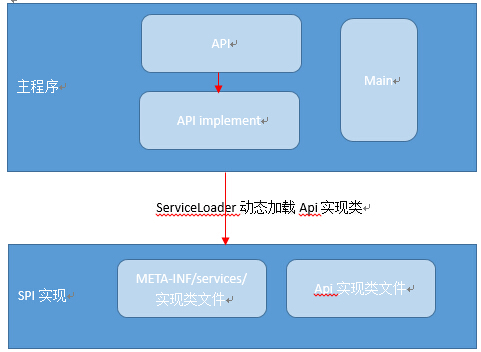

## 一、SPI机制

这里先说下SPI的一个概念，SPI英文为Service Provider Interface，单从字面可以理解为Service提供者接口，正如从SPI的名字去理解SPI就是Service提供者接口，我对SPI的定义：提供给服务提供厂商与扩展框架功能的开发者使用的接口。

在我们日常开发的时候都是对问题进行抽象成Api然后就提供各种Api的实现，这些Api的实现都是封装与我们的Jar中或框架中的虽然当我们想要提供一种Api新实现时可以不修改原来代码只需实现该Api就可以提供Api的新实现，但我们还是生成新Jar或框架（虽然可以通过在代码里扫描某个目录已加载Api的新实现，但这不是Java的机制，只是hack方法），而通过Java SPI机制我们就可以在不修改Jar包或框架的时候为Api提供新实现。

很多框架都使用了java的SPI机制，如java.sql.Driver的SPI实现（MySQL驱动、oracle驱动等）、common-logging的日志接口实现、dubbo的扩展实现等等框架；

SPI机制的约定：
1. 在META-INF/services/目录中创建以接口完全限定名命名的文件，该文件内容为Api具体实现类的全限定名
2. 使用ServiceLoader类动态加载META-INF中的实现类
3. 如SPI的实现类为Jar则需要放在主程序classPath中
4. Api具体实现类必须有一个不带参数的构造方法

[参考文章](http://blog.csdn.net/zmx729618/article/details/53285416)